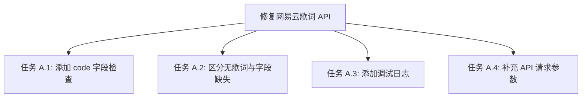
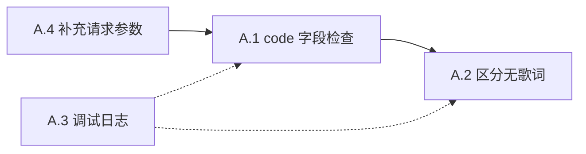

# 功能规划：修复网易云歌词获取 API 错误处理

**规划时间**：2026-02-27
**预估工作量**：3 任务点

---

## 1. 功能概述

### 1.1 目标
修复 `crates/netease/src/api.rs` 中 `lyrics` 函数的错误处理缺陷，使其能正确识别 API 业务错误码、区分"无歌词"与"获取失败"、并添加调试日志。

### 1.2 范围
**包含**：
- 检查 API 响应 JSON 中的 `code` 字段
- 区分"无歌词"（返回空 `Vec`）和"API 报错"（返回 `SourceError`）
- 添加 `log::debug!` / `log::warn!` 日志
- 补充 API 请求参数（`kv`、`rv`）以获取更完整的歌词数据

**不包含**：
- 修改 `MusicSource` trait 接口签名
- 修改 `SourceError` 枚举定义
- 修改 `parse_lyrics` / `parse_lrc_lines` 解析逻辑
- 修改 QQ 音乐歌词获取逻辑

### 1.3 技术约束
- 修改范围仅限 `crates/netease/src/api.rs` 的 `lyrics` 函数（第 89-108 行）
- 返回类型保持 `Result<Vec<LyricsLine>, SourceError>` 不变
- `log` crate 已在 `Cargo.toml` 中声明（`log = "0.4"`），无需新增依赖

---

## 2. WBS 任务分解

### 2.1 分解结构图



### 2.2 任务清单

#### 模块 A：网易云歌词 API 修复（3 任务点）

**文件**: `crates/netease/src/api.rs`（第 89-108 行，`lyrics` 函数）

---

- [ ] **任务 A.1**：添加 API 响应 `code` 字段检查（1 点）
  - **输入**：API 返回的 JSON `Value`
  - **输出**：非 200 code 时返回对应 `SourceError`
  - **关键步骤**：
    1. 在 `res.json()` 解析成功后，提取 `value["code"]` 字段
    2. 复用 `weapi_post` 的错误码判断模式：
       - `code == 50000005 || code == -462` → `SourceError::Unauthorized`
       - `code == 404 || code == -1` → `SourceError::NotFound`
       - `code != 200` → `SourceError::InvalidResponse(format!("netease lyrics code {code}"))`
    3. 无 `code` 字段时视为异常，记录 warn 日志但不阻断（兼容旧版 API 响应）
  - **参考代码**（`weapi_post` 第 182-189 行）：
    ```rust
    if let Some(code) = value.get("code").and_then(|v| v.as_i64()) {
        if code == 50000005 || code == -462 {
            return Err(SourceError::Unauthorized);
        }
        if code != 200 {
            return Err(SourceError::InvalidResponse(format!("code {code}")));
        }
    }
    ```

---

- [ ] **任务 A.2**：区分"无歌词"与"获取失败"（0.5 点）
  - **输入**：通过 code 检查后的 JSON `Value`
  - **输出**：`lrc.lyric` 为 null/空时返回 `Ok(Vec::new())`，有内容时正常解析
  - **关键步骤**：
    1. 将 `value.pointer("/lrc/lyric")` 的结果分三种情况处理：
       - **路径存在且为非空字符串**：正常解析歌词
       - **路径存在但为 null 或空字符串**：返回 `Ok(Vec::new())`（纯音乐/无歌词）
       - **路径不存在（`/lrc` 节点本身缺失）**：记录 warn 日志，返回 `Ok(Vec::new())`
    2. `tlyric` 的处理保持宽松：缺失或为空时传空字符串给 `parse_lyrics`（翻译歌词是可选的）
  - **当前代码问题**：
    ```rust
    // 当前：null 和 "" 和 "有内容" 全部走同一路径，无法区分
    let lrc = value.pointer("/lrc/lyric").and_then(|v| v.as_str()).unwrap_or("");
    ```
  - **修复后逻辑**：
    ```rust
    let lrc_str = match value.pointer("/lrc/lyric").and_then(|v| v.as_str()) {
        Some(s) if !s.trim().is_empty() => s,
        _ => {
            log::debug!("netease lyrics: no lrc content for track {track_id}");
            return Ok(Vec::new());
        }
    };
    let tlyric_str = value.pointer("/tlyric/lyric")
        .and_then(|v| v.as_str())
        .unwrap_or("");
    Ok(parse_lyrics(lrc_str, tlyric_str))
    ```

---

- [ ] **任务 A.3**：添加调试日志（0.5 点）
  - **输入**：函数执行过程中的关键节点
  - **输出**：`log::debug!` 和 `log::warn!` 日志输出
  - **关键步骤**：
    1. 函数入口：`log::debug!("netease lyrics: fetching track_id={track_id}")`
    2. API 响应 code 异常时：`log::warn!("netease lyrics: api returned code {code} for track {track_id}")`
    3. 无歌词时：`log::debug!("netease lyrics: no lrc content for track {track_id}")`（已在 A.2 中包含）
    4. 成功解析时：`log::debug!("netease lyrics: parsed {} lines for track {track_id}", lines.len())`

---

- [ ] **任务 A.4**：补充 API 请求参数（1 点）
  - **输入**：网易云歌词 API 参数文档
  - **输出**：更完整的请求参数，获取逐字歌词和罗马音
  - **关键步骤**：
    1. 当前参数：`id`, `lv=1`, `tv=1`
    2. 补充参数：
       - `kv=1`：请求逐字（卡拉 OK）歌词
       - `rv=1`：请求罗马音歌词
    3. 虽然当前 `parse_lyrics` 不处理 `klyric`/`romalrc`，但提前请求可避免后续需要时再改接口
    4. 修改 query 参数：
       ```rust
       // 修改前
       .query(&[("id", track_id), ("lv", "1"), ("tv", "1")])
       // 修改后
       .query(&[("id", track_id), ("lv", "1"), ("tv", "1"), ("kv", "1"), ("rv", "1")])
       ```

---

## 3. 依赖关系

### 3.1 依赖图



### 3.2 依赖说明

| 任务 | 依赖于 | 原因 |
|------|--------|------|
| A.1 | A.4 | 请求参数调整在前，响应处理在后（实际可合并为一次修改） |
| A.2 | A.1 | 必须先通过 code 检查，再处理歌词内容 |
| A.3 | A.1, A.2 | 日志穿插在各处理节点中，随各任务一起实现 |

### 3.3 实施说明

四个任务实际上是对同一个函数的修改，建议合并为一次代码变更。任务拆分仅用于逻辑梳理。

---

## 4. 实施方案

### 4.1 修改后的完整 `lyrics` 函数

```rust
pub async fn lyrics(
    http: &reqwest::Client,
    base_url: &str,
    track_id: &str,
    cookie: Option<&str>,
) -> Result<Vec<LyricsLine>, SourceError> {
    log::debug!("netease lyrics: fetching track_id={track_id}");

    let url = format!("{base_url}/api/song/lyric");
    let mut req = http
        .get(url)
        .query(&[("id", track_id), ("lv", "1"), ("tv", "1"), ("kv", "1"), ("rv", "1")]);
    if let Some(c) = cookie {
        req = req.header(COOKIE, c);
    }

    let res = req.send().await.map_err(|e| SourceError::Network(e.to_string()))?;
    if !res.status().is_success() {
        return Err(SourceError::Network(format!("http {}", res.status())));
    }

    let value: Value = res.json().await.map_err(|e| SourceError::InvalidResponse(e.to_string()))?;

    // --- 检查 API 业务错误码（与 weapi_post 保持一致） ---
    if let Some(code) = value.get("code").and_then(|v| v.as_i64()) {
        if code == 50000005 || code == -462 {
            log::warn!("netease lyrics: unauthorized (code {code}) for track {track_id}");
            return Err(SourceError::Unauthorized);
        }
        if code != 200 {
            log::warn!("netease lyrics: api error code {code} for track {track_id}");
            return Err(SourceError::InvalidResponse(
                format!("netease lyrics code {code}"),
            ));
        }
    } else {
        log::warn!("netease lyrics: response missing 'code' field for track {track_id}");
    }

    // --- 区分"无歌词"与正常歌词 ---
    let lrc_str = match value.pointer("/lrc/lyric").and_then(|v| v.as_str()) {
        Some(s) if !s.trim().is_empty() => s,
        _ => {
            log::debug!("netease lyrics: no lrc content for track {track_id}");
            return Ok(Vec::new());
        }
    };
    let tlyric_str = value
        .pointer("/tlyric/lyric")
        .and_then(|v| v.as_str())
        .unwrap_or("");

    let lines = parse_lyrics(lrc_str, tlyric_str);
    log::debug!("netease lyrics: parsed {} lines for track {track_id}", lines.len());
    Ok(lines)
}
```

### 4.2 变更对比

| 方面 | 修改前 | 修改后 |
|------|--------|--------|
| API 参数 | `lv=1, tv=1` | `lv=1, tv=1, kv=1, rv=1` |
| code 检查 | 无 | 检查 200/50000005/-462 等错误码 |
| 无歌词处理 | `unwrap_or("")` 后传入解析器 | 提前返回 `Ok(Vec::new())` |
| 日志 | 无 | 入口 debug、错误 warn、无歌词 debug、成功 debug |

---

## 5. 潜在风险

| 风险 | 影响 | 缓解措施 |
|------|------|----------|
| 某些旧版 API 响应不含 `code` 字段 | 低 | 仅记录 warn 日志，不阻断流程，继续尝试解析歌词 |
| 新增 `kv`/`rv` 参数导致未登录时返回错误 | 低 | 网易云歌词接口通常不需要登录；若出错会被 code 检查捕获 |
| 纯音乐歌曲 `lrc.lyric` 可能为 `"[00:00.000] 纯音乐，请欣赏\n"` | 中 | 当前不做特殊处理，前端正常显示该文本即可；后续可在 Phase 2 识别 |

---

## 6. 验收标准

- [ ] API 返回 `{"code": -1}` 时，函数返回 `SourceError::InvalidResponse`
- [ ] API 返回 `{"code": 50000005}` 时，函数返回 `SourceError::Unauthorized`
- [ ] API 返回 `{"code": 200, "lrc": {"lyric": null}}` 时，函数返回 `Ok(vec![])`
- [ ] API 返回 `{"code": 200, "lrc": {"lyric": ""}}` 时，函数返回 `Ok(vec![])`
- [ ] API 返回 `{"code": 200, "lrc": {"lyric": "[00:01.00]歌词"}}` 时，正常解析返回歌词
- [ ] 日志中可见 `netease lyrics:` 前缀的 debug/warn 信息
- [ ] `cargo check -p rustplayer-netease` 编译通过
- [ ] `MusicSource` trait 接口签名未变

---

## 7. 后续优化方向（Phase 2）

- 识别纯音乐标记（`lrc.lyric` 仅含 `"纯音乐，请欣赏"` 时返回特殊标识）
- 解析 `klyric`（逐字歌词）支持卡拉 OK 模式
- 解析 `romalrc`（罗马音）支持日文/韩文歌曲注音显示
- 歌词请求失败时的重试机制
