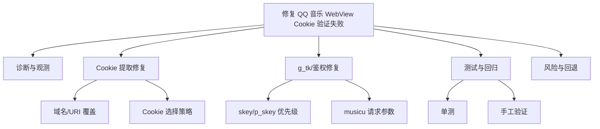
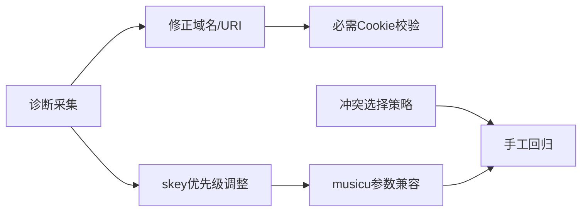

# 功能规划：修复 QQ 音乐 WebView 登录后 Cookie 验证失败（40000 unauthorized）

**规划时间**：2026-02-28  
**预估工作量**：18 任务点

---

## 1. 功能概述

### 1.1 目标

在 Linux + webkit2gtk 环境下，用户通过：

- 手机 QQ 扫码登录
- QQ 客户端快捷登录

完成 QQ 音乐 WebView 登录后，后端能够稳定提取正确的鉴权 Cookie，并通过 `user_playlists` 验证成功，避免出现 `40000 unauthorized` 与 `login after cookie capture failed: unauthorized`。

### 1.2 范围

**包含**：
- 修复/增强 Cookie 提取（特别是 `skey/p_skey/p_uin` 等 HttpOnly Cookie 的覆盖与选择策略）
- 修复/增强 `g_tk` 计算与请求参数，确保与 QQ 音乐接口鉴权匹配
- 增强日志与诊断能力（不泄露敏感 Cookie 值）
- 增加单元测试覆盖关键逻辑

**不包含**：
- 改造整体 WebView 登录架构/交互
- 引入新第三方依赖
- 实现自动刷新登录态/Token

### 1.3 技术约束

- 平台：Linux + webkit2gtk（非 Linux 仍保留 JS fallback）
- 语言：Rust
- 不新增第三方依赖
- 修改范围主要在：
  - `crates/qqmusic`（签名/请求参数）
  - `apps/rustplayer-tauri/src-tauri/src/commands`（Cookie 提取/登录验证）

---

## 2. WBS 任务分解

### 2.1 分解结构图

### 2.2 任务清单

#### 模块 B：诊断与观测（4 任务点）

**文件**：`commands/mod.rs`、`qqmusic/api.rs`、`qqmusic/sign.rs`

- [ ] **任务 B.1**：复现路径与证据采集（2 点）
  - **输入**：两种登录方式（扫码 / 快捷登录）、现有日志
  - **输出**：每种登录方式的一份“Cookie 可见性报告”
  - **关键步骤**：
    1. 在登录窗口“检测到登录”后，记录每个候选 URI 的 `cookie_manager.cookies(uri)` 返回的 cookie 名称集合（仅名称/属性，不打印值）
    2. 重点确认：`skey`、`p_skey`、`p_uin`、`pt4_token` 是否存在、是否为 HttpOnly、属于哪个 domain/path
    3. 记录 `user_playlists` 返回的 `code/msg/subcode`（已在 `qqmusic/api.rs` 有增强日志）

- [ ] **任务 B.2**：鉴权关键路径打点（2 点）
  - **输入**：现有 `extract_skey_from_cookie` 与 `musicu_post` 实现
  - **输出**：日志能明确指出“g_tk 来源（p_skey/skey/qm_keyst/none）”与“缺失的必需 Cookie”
  - **关键步骤**：
    1. 在 `musicu_post` 中记录：是否从 cookie 提取到 `p_skey/skey/qm_keyst`（只记录命中类型与长度，不记录值）
    2. 在登录验证失败（40000）时，记录 cookie 中是否包含 `uin/p_uin`、`skey/p_skey` 的布尔信息

#### 模块 C：Cookie 提取修复（7 任务点）

**文件**：`commands/mod.rs`

- [ ] **任务 C.1**：修正 QQ 音乐 Cookie 域名/URI 覆盖（3 点）
  - **输入**：当前 `cookie_domains`（QQ 音乐包含 `https://.qq.com`）
  - **输出**：CookieManager 查询的 URI 全部为合法 URI，且覆盖 `p_skey` 常见落点
  - **关键步骤**：
    1. 将 `https://.qq.com` 替换为合法候选（例如 `https://qq.com/`、`https://y.qq.com/`、`https://music.qq.com/`、必要时 `https://ptlogin2.qq.com/`）
    2. 以“最小覆盖”方式逐步加域名：优先用诊断结果确认 `p_skey` 实际属于哪个域
    3. 同步修正清理 cookie 的域名列表，避免清理不完整导致误判

- [ ] **任务 C.2**：增强 Cookie 合并与冲突处理策略（2 点）
  - **输入**：当前按 name 去重的 HashMap 合并逻辑
  - **输出**：当同名 cookie 存在多个 domain/path 时，选择更符合 `u.y.qq.com` 请求的那一个
  - **关键步骤**：
    1. 在 webkit 提取阶段保留 `domain/path` 元数据（不必持久化，内存内用于选择）
    2. 选择规则建议：同名 cookie 取“domain 更具体（更长）且能匹配目标 host”的条目

- [ ] **任务 C.3**：必需 Cookie 校验与失败快返（2 点）
  - **输入**：QQ 音乐鉴权所需最小集合（诊断阶段产出）
  - **输出**：提取到的 cookie 若缺少关键项，直接判定为“提取不完整”而不是进入验证后 40000
  - **关键步骤**：
    1. 为 QQ 音乐定义最小必需集合（初版建议：`p_skey|skey` + `p_uin|uin` + `qqmusic_key`）
    2. 缺失时输出结构化日志（缺哪些 key），并引导用户重新登录/等待写入完成（可增加短重试）

#### 模块 D：g_tk/鉴权修复（4 任务点）

**文件**：`qqmusic/sign.rs`、`qqmusic/api.rs`

- [ ] **任务 D.1**：调整 skey 选择优先级（2 点）
  - **输入**：现有 `extract_skey_from_cookie` 顺序：`skey → p_skey → qm_keyst`
  - **输出**：优先使用更可能适配 `y.qq.com/u.y.qq.com` 的 `p_skey`，必要时回退 `skey`
  - **关键步骤**：
    1. 将顺序调整为 `p_skey → skey → qm_keyst`（以诊断结果为准）
    2. 若同时存在 `p_skey` 与 `skey`，记录一次 info 日志说明选择了哪个（不打印值）

- [ ] **任务 D.2**：完善 `musicu_post` 的鉴权参数兼容性（2 点）
  - **输入**：当前仅带 `g_tk`
  - **输出**：提高对不同 QQ 登录态的兼容，减少 40000
  - **关键步骤**：
    1. 评估是否需要同时携带 `g_tk_new`（常见腾讯系接口会同时读取）
    2. 当 `p_skey/skey` 都不存在时，避免默认 `5381` 误导：改为显式报错或降低验证 API 的调用频率（由诊断结论决定）

#### 模块 E：测试与回归（3 任务点）

**文件**：`qqmusic/sign.rs`（新增单测）、可选新增 `qqmusic/api.rs` 的纯函数测试点

- [ ] **任务 E.1**：补齐签名/提取单元测试（2 点）
  - **输入**：`extract_uin_from_cookie`、`extract_skey_from_cookie`、`calculate_g_tk`
  - **输出**：覆盖关键边界与优先级的测试用例
  - **关键步骤**：
    1. 用构造 cookie 字符串验证 `p_skey` 优先级与 `uin/p_uin` 提取
    2. 为 `calculate_g_tk` 增加 golden case（固定输入输出）

- [ ] **任务 E.2**：两种登录方式手工回归（1 点）
  - **输入**：打点日志 + 修复后的提取/鉴权逻辑
  - **输出**：两种方式均通过 `user_playlists` 验证，日志不再出现 unauthorized
  - **关键步骤**：
    1. 执行扫码登录一次、快捷登录一次
    2. 检查日志：是否提取到 `p_skey/skey`；`musicu_post` 是否使用了正确 g_tk 来源
    3. 验证 `get_user_playlists` 返回非空或正常结构数据

#### 模块 F：风险评估与回退（0 任务点，随任务同步）

---

## 3. 依赖关系

### 3.1 依赖图

### 3.2 依赖说明

| 任务 | 依赖于 | 原因 |
|------|--------|------|
| C.1 | B.1 | 需要先确认 `p_skey` 实际落点域名/URI |
| D.1 | B.2 | 需要先确认当前 g_tk 来源与失败模式 |
| E.2 | C.* + D.* | 需要修复完成后再回归验证 |

### 3.3 并行任务

以下任务可并行推进（无文件写冲突或可拆分小改）：

- B.1（诊断采集） ∥ E.1（补单测骨架与用例设计）
- C.1（域名/URI 修正） ∥ D.1（skey 优先级调整）

---

## 4. 实施建议

### 4.1 技术选型（保持现状 + 增强）

- Cookie 提取：继续以 Linux 的 `webkit2gtk CookieManager` 为主（可读 HttpOnly），JS `document.cookie` 仅作为非 Linux/兜底
- 鉴权参数：以 `p_skey/skey → g_tk` 为主，补齐常见兼容参数（如 `g_tk_new`）以覆盖不同登录态

### 4.2 潜在风险与缓解

- 风险：扩大 URI 覆盖后误捞到同名 cookie，导致选择错误  
  缓解：引入 domain/path 元数据选择策略，且仅输出必要 cookie 到最终 header

- 风险：日志泄露敏感信息  
  缓解：只记录 cookie 名称、布尔存在性、长度、属性（HttpOnly/Secure），严禁打印 value

- 风险：不同登录方式写入 cookie 时序不同，提取过早导致缺关键项  
  缓解：检测到登录后增加短暂重试窗口（如 1~2 秒内重试 2 次），并用必需集合校验

### 4.3 回退方案

- 保留现有 `qm_keyst` fallback，但在验证失败时输出更明确诊断，避免“看似成功提取但必然 40000”
- 将新增的 URI 覆盖做成“可逐步扩展”的列表：若引入问题，可快速回退到最小集合（`y.qq.com` + `qq.com`）

---

## 5. 验收标准

- [ ] WebView 登录后能成功验证 Cookie（`src.login(creds)` 返回 OK）
- [ ] `user_playlists` API 调用返回正常数据（`/req/code == 0`）
- [ ] 日志中不再出现 `login after cookie capture failed: unauthorized`
- [ ] QQ 扫码登录与 QQ 客户端快捷登录两种方式均通过回归验证

