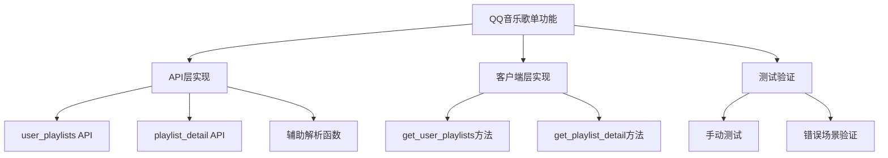
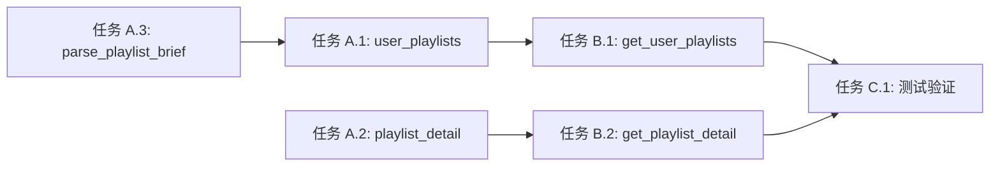

# 功能规划：QQ 音乐歌单管理功能

**规划时间**：2026-02-27
**预估工作量**：8 任务点

---

## 1. 功能概述

### 1.1 目标

为 QQ 音乐客户端实现歌单管理功能，使其与网易云音乐保持功能对等，支持：
- 获取用户收藏的歌单列表
- 获取指定歌单的详细信息及曲目列表

### 1.2 范围

**包含**：
- `get_user_playlists()` - 获取当前登录用户的歌单列表（收藏的歌单）
- `get_playlist_detail(id)` - 获取指定歌单的详情及完整曲目列表
- Cookie 认证支持（复用现有认证机制）
- 错误处理（未登录、网络错误、歌单不存在等）

**不包含**：
- 创建/删除/编辑歌单功能
- 歌单收藏/取消收藏
- 歌单排序/分类
- 分页加载（首次实现获取全部歌单）

### 1.3 技术约束

- **API 调用方式**：使用现有的 `musicu_post()` 函数，通过 `/cgi-bin/musicu.fcg` 统一接口
- **认证机制**：通过 Cookie 认证（复用 `self.cookie: RwLock<Option<String>>`）
- **数据结构**：使用 `rustplayer_core` 中定义的 `PlaylistBrief` 和 `Playlist` 类型
- **错误处理**：使用 `SourceError` 枚举（Unauthorized / NotFound / Network / InvalidResponse）
- **代码风格**：参考网易云音乐实现，保持一致性

---

## 2. WBS 任务分解

### 2.1 分解结构图



### 2.2 任务清单

#### 模块 A：API 层实现（5 任务点）

**文件**: `crates/qqmusic/src/api.rs`

- [ ] **任务 A.1**：实现 `user_playlists()` 函数（2 点）
  - **输入**：http client, base_url, cookie
  - **输出**：`Result<Vec<PlaylistBrief>, SourceError>`
  - **关键步骤**：
    1. 构造 musicu.fcg 请求体（module: `music.playlist.PlaylistSquare`, method: `GetMyPlaylist`）
    2. 调用 `musicu_post()` 发送请求
    3. 解析响应 JSON，提取歌单列表数组
    4. 调用 `parse_playlist_brief()` 解析每个歌单
    5. 处理未登录场景（返回 `SourceError::Unauthorized`）

- [ ] **任务 A.2**：实现 `playlist_detail()` 函数（2 点）
  - **输入**：http client, base_url, playlist_id, cookie
  - **输出**：`Result<Playlist, SourceError>`
  - **关键步骤**：
    1. 构造 musicu.fcg 请求体（module: `music.srfDissInfo.airia`, method: `uniform_get_Dissinfo`）
    2. 调用 `musicu_post()` 发送请求
    3. 解析响应 JSON，提取歌单基本信息（name, description, cover）
    4. 提取曲目列表，调用 `parse_song()` 解析每首歌
    5. 处理歌单不存在场景（返回 `SourceError::NotFound`）

- [ ] **任务 A.3**：实现 `parse_playlist_brief()` 辅助函数（1 点）
  - **输入**：JSON Value（单个歌单对象）
  - **输出**：`Option<PlaylistBrief>`
  - **关键步骤**：
    1. 提取字段：dissid/tid（歌单ID）、dissname/diss_name（名称）、logo（封面）、song_cnt（曲目数）
    2. 处理字段缺失情况（返回 None）
    3. 构造 `PlaylistBrief` 结构体，source 设为 `MusicSourceId::Qqmusic`

#### 模块 B：客户端层实现（2 任务点）

**文件**: `crates/qqmusic/src/lib.rs`

- [ ] **任务 B.1**：实现 `get_user_playlists()` 方法（1 点）
  - **输入**：&self
  - **输出**：`Result<Vec<PlaylistBrief>, SourceError>`
  - **关键步骤**：
    1. 调用 `api::user_playlists(&self.http, &self.base_url, self.cookie().as_deref())`
    2. 直接返回结果（无需额外处理）

- [ ] **任务 B.2**：实现 `get_playlist_detail()` 方法（1 点）
  - **输入**：&self, id: &str
  - **输出**：`Result<Playlist, SourceError>`
  - **关键步骤**：
    1. 调用 `api::playlist_detail(&self.http, &self.base_url, id, self.cookie().as_deref())`
    2. 直接返回结果（无需额外处理）

#### 模块 C：测试验证（1 任务点）

**验证方式**：手动测试 + 日志验证

- [ ] **任务 C.1**：功能测试（1 点）
  - **测试场景**：
    1. 未登录状态调用 `get_user_playlists()` → 返回 `Unauthorized`
    2. 已登录状态调用 `get_user_playlists()` → 返回歌单列表
    3. 调用 `get_playlist_detail()` 获取有效歌单 → 返回歌单详情
    4. 调用 `get_playlist_detail()` 获取无效 ID → 返回 `NotFound`
  - **验证方式**：
    - 通过前端 UI 触发调用
    - 检查日志输出（traceId 链路追踪）
    - 验证返回数据结构正确性

---

## 3. 依赖关系

### 3.1 依赖图



### 3.2 依赖说明

| 任务 | 依赖于 | 原因 |
|------|--------|------|
| A.1 | A.3 | `user_playlists()` 需要调用 `parse_playlist_brief()` 解析数据 |
| B.1 | A.1 | 客户端方法需要 API 函数完成 |
| B.2 | A.2 | 客户端方法需要 API 函数完成 |
| C.1 | B.1, B.2 | 测试需要所有功能实现完成 |

### 3.3 并行任务

以下任务可以并行开发：
- 任务 A.2 ∥ 任务 A.3（playlist_detail 不依赖 parse_playlist_brief）
- 任务 A.1 和 A.2 完成后，B.1 ∥ B.2 可并行

---

## 4. 技术实现细节

### 4.1 QQ 音乐 API 端点分析

#### 4.1.1 获取用户歌单列表

**API 端点**：`POST /cgi-bin/musicu.fcg`

**请求体结构**：
```json
{
  "comm": {
    "ct": "19",
    "cv": "1859",
    "uin": "0"
  },
  "req": {
    "module": "music.playlist.PlaylistSquare",
    "method": "GetMyPlaylist",
    "param": {
      "uin": 0,
      "sin": 0,
      "size": 100
    }
  }
}
```

**响应结构**（预期）：
```json
{
  "req": {
    "code": 0,
    "data": {
      "list": [
        {
          "dissid": "7234567890",
          "dissname": "我喜欢的音乐",
          "logo": "https://y.qq.com/music/photo_new/...",
          "song_cnt": 42
        }
      ]
    }
  }
}
```

**字段映射**：
- `dissid` / `tid` → PlaylistBrief.id
- `dissname` / `diss_name` → PlaylistBrief.name
- `logo` → PlaylistBrief.cover_url
- `song_cnt` → PlaylistBrief.track_count

#### 4.1.2 获取歌单详情

**API 端点**：`POST /cgi-bin/musicu.fcg`

**请求体结构**：
```json
{
  "comm": {
    "ct": "19",
    "cv": "1859",
    "uin": "0"
  },
  "req": {
    "module": "music.srfDissInfo.airia",
    "method": "uniform_get_Dissinfo",
    "param": {
      "disstid": "7234567890",
      "userinfo": 1,
      "tag": 1
    }
  }
}
```

**响应结构**（预期）：
```json
{
  "req": {
    "code": 0,
    "data": {
      "dirinfo": {
        "title": "我喜欢的音乐",
        "desc": "歌单描述",
        "logo": "https://y.qq.com/music/photo_new/..."
      },
      "songlist": [
        {
          "songmid": "001ABC123",
          "songname": "歌曲名",
          "singer": [{"name": "歌手名"}],
          "albumname": "专辑名",
          "interval": 240
        }
      ]
    }
  }
}
```

**字段映射**：
- `dirinfo.title` → Playlist.name
- `dirinfo.desc` → Playlist.description
- `dirinfo.logo` → Playlist.cover_url
- `songlist` → Playlist.tracks（通过 `parse_song()` 解析）

### 4.2 代码实现示例

#### 4.2.1 `api.rs` 新增函数

```rust
// 在 crates/qqmusic/src/api.rs 末尾添加

pub async fn user_playlists(
    http: &reqwest::Client,
    base_url: &str,
    cookie: Option<&str>,
) -> Result<Vec<PlaylistBrief>, SourceError> {
    let data = json!({
        "comm": { "ct": "19", "cv": "1859", "uin": "0" },
        "req": {
            "module": "music.playlist.PlaylistSquare",
            "method": "GetMyPlaylist",
            "param": {
                "uin": 0,
                "sin": 0,
                "size": 100
            }
        }
    });

    let value = musicu_post(http, base_url, &data, cookie).await?;

    // 检查是否需要登录
    let code = value.pointer("/req/code").and_then(|v| v.as_i64()).unwrap_or(-1);
    if code != 0 {
        return Err(SourceError::Unauthorized);
    }

    let Some(list) = value.pointer("/req/data/list").and_then(|v| v.as_array()) else {
        return Ok(Vec::new());
    };

    Ok(list.iter().filter_map(parse_playlist_brief).collect())
}

pub async fn playlist_detail(
    http: &reqwest::Client,
    base_url: &str,
    playlist_id: &str,
    cookie: Option<&str>,
) -> Result<Playlist, SourceError> {
    let data = json!({
        "comm": { "ct": "19", "cv": "1859", "uin": "0" },
        "req": {
            "module": "music.srfDissInfo.airia",
            "method": "uniform_get_Dissinfo",
            "param": {
                "disstid": playlist_id,
                "userinfo": 1,
                "tag": 1
            }
        }
    });

    let value = musicu_post(http, base_url, &data, cookie).await?;

    let code = value.pointer("/req/code").and_then(|v| v.as_i64()).unwrap_or(-1);
    if code != 0 {
        return Err(SourceError::NotFound);
    }

    let data = value.pointer("/req/data").ok_or_else(|| SourceError::NotFound)?;
    let dirinfo = data.get("dirinfo").ok_or_else(|| SourceError::NotFound)?;

    let name = dirinfo.get("title").and_then(|v| v.as_str()).unwrap_or("").to_string();
    let description = dirinfo.get("desc").and_then(|v| v.as_str()).map(|s| s.to_string());
    let cover_url = dirinfo.get("logo").and_then(|v| v.as_str()).map(|s| s.to_string());

    let tracks = data
        .get("songlist")
        .and_then(|v| v.as_array())
        .map(|arr| arr.iter().filter_map(parse_song).collect())
        .unwrap_or_default();

    Ok(Playlist {
        id: playlist_id.to_string(),
        name,
        description,
        cover_url,
        tracks,
        source: MusicSourceId::Qqmusic,
    })
}

fn parse_playlist_brief(item: &Value) -> Option<PlaylistBrief> {
    // QQ音乐歌单ID字段可能是 dissid 或 tid
    let id = item.get("dissid")
        .or_else(|| item.get("tid"))
        .and_then(|v| v.as_str())
        .or_else(|| item.get("dissid").and_then(|v| v.as_i64()).map(|n| n.to_string().leak() as &str))?;

    let name = item.get("dissname")
        .or_else(|| item.get("diss_name"))
        .and_then(|v| v.as_str())
        .unwrap_or("")
        .to_string();

    let cover_url = item.get("logo")
        .and_then(|v| v.as_str())
        .map(|s| s.to_string());

    let track_count = item.get("song_cnt")
        .and_then(|v| v.as_u64())
        .unwrap_or(0) as u32;

    Some(PlaylistBrief {
        id: id.to_string(),
        name,
        cover_url,
        track_count,
        source: MusicSourceId::Qqmusic,
    })
}
```

#### 4.2.2 `lib.rs` 新增方法

```rust
// 在 crates/qqmusic/src/lib.rs 的 impl MusicSource for QqMusicClient 中添加

async fn get_user_playlists(&self) -> Result<Vec<PlaylistBrief>, SourceError> {
    api::user_playlists(&self.http, &self.base_url, self.cookie().as_deref()).await
}

async fn get_playlist_detail(&self, id: &str) -> Result<Playlist, SourceError> {
    api::playlist_detail(&self.http, &self.base_url, id, self.cookie().as_deref()).await
}
```

#### 4.2.3 需要导入的类型

在 `crates/qqmusic/src/lib.rs` 顶部添加：
```rust
use rustplayer_core::{
    AuthToken, Credentials, LyricsLine, MusicSource, MusicSourceId,
    Playlist, PlaylistBrief,  // 新增这两个类型
    SearchQuery, SourceError, StreamInfo, Track,
};
```

在 `crates/qqmusic/src/api.rs` 顶部添加：
```rust
use rustplayer_core::{
    LyricsLine, MusicSourceId,
    Playlist, PlaylistBrief,  // 新增这两个类型
    SearchQuery, SourceError, StreamInfo, Track
};
```

---

## 5. 错误处理策略

### 5.1 错误场景映射

| 场景 | HTTP 状态 / API Code | 返回错误 |
|------|---------------------|----------|
| 未登录调用 user_playlists | code != 0 | `SourceError::Unauthorized` |
| 网络请求失败 | reqwest Error | `SourceError::Network(e.to_string())` |
| HTTP 非 2xx | status.is_success() = false | `SourceError::Network(format!("http {}", status))` |
| JSON 解析失败 | serde_json Error | `SourceError::InvalidResponse(e.to_string())` |
| 歌单不存在 | code != 0 或缺少 data | `SourceError::NotFound` |
| 响应结构异常 | 缺少必需字段 | `SourceError::InvalidResponse("missing field")` |

### 5.2 日志记录

在关键位置添加日志：
```rust
log::debug!("qqmusic user_playlists: fetching for cookie={:?}", cookie.is_some());
log::debug!("qqmusic playlist_detail: fetching playlist_id={}", playlist_id);
log::warn!("qqmusic user_playlists: unauthorized, code={}", code);
```

---

## 6. 测试验证方案

### 6.1 前置条件

1. 确保 QQ 音乐账号已通过 WebView 登录（Cookie 已保存）
2. 账号至少有 1 个收藏的歌单
3. 准备一个有效的歌单 ID 和一个无效的歌单 ID

### 6.2 测试用例

#### 测试用例 1：未登录获取歌单列表

**步骤**：
1. 清除 Cookie（调用 `logout()`）
2. 调用 `get_user_playlists()`

**预期结果**：
- 返回 `Err(SourceError::Unauthorized)`
- 前端显示"请先登录"提示

#### 测试用例 2：已登录获取歌单列表

**步骤**：
1. 通过 WebView 登录 QQ 音乐
2. 调用 `get_user_playlists()`

**预期结果**：
- 返回 `Ok(Vec<PlaylistBrief>)`
- 列表包含用户收藏的歌单
- 每个歌单包含：id, name, cover_url, track_count

#### 测试用例 3：获取有效歌单详情

**步骤**：
1. 从测试用例 2 获取的歌单列表中选择一个 ID
2. 调用 `get_playlist_detail(id)`

**预期结果**：
- 返回 `Ok(Playlist)`
- 包含歌单基本信息（name, description, cover_url）
- tracks 列表包含完整曲目信息

#### 测试用例 4：获取无效歌单详情

**步骤**：
1. 使用一个不存在的歌单 ID（如 "999999999"）
2. 调用 `get_playlist_detail("999999999")`

**预期结果**：
- 返回 `Err(SourceError::NotFound)`
- 前端显示"歌单不存在"提示

### 6.3 验证清单

- [ ] 代码编译通过（`cargo check`）
- [ ] 未登录场景返回 Unauthorized
- [ ] 已登录场景返回歌单列表
- [ ] 歌单详情包含完整曲目列表
- [ ] 无效 ID 返回 NotFound
- [ ] 日志包含 traceId 链路追踪信息
- [ ] 前端 UI 正确显示歌单数据

---

## 7. 潜在风险与缓解措施

### 7.1 风险识别

| 风险 | 影响 | 概率 | 缓解措施 |
|------|------|------|----------|
| QQ 音乐 API 字段名称不确定 | 高 | 中 | 使用 `.or_else()` 兼容多种字段名（dissid/tid, dissname/diss_name） |
| API module/method 名称错误 | 高 | 中 | 参考网络抓包或官方文档，准备备用方案 |
| 歌单数量过多导致超时 | 中 | 低 | 首次实现限制 size=100，后续支持分页 |
| Cookie 过期导致认证失败 | 中 | 中 | 返回 Unauthorized，提示用户重新登录 |
| 响应结构与预期不符 | 高 | 中 | 添加详细日志，记录原始响应便于调试 |

### 7.2 备用方案

如果 `music.playlist.PlaylistSquare.GetMyPlaylist` 不可用，可尝试：
- 备用 module: `music.playlist.PlaylistRead`
- 备用 method: `GetUserPlaylist` 或 `GetUserDiss`

如果 `music.srfDissInfo.airia.uniform_get_Dissinfo` 不可用，可尝试：
- 备用 module: `music.playlist.PlaylistRead`
- 备用 method: `GetPlaylistDetail` 或 `GetDissInfo`

---

## 8. 实施建议

### 8.1 开发顺序

1. **Phase 1**：实现 API 层（任务 A.3 → A.1 → A.2）
   - 先实现 `parse_playlist_brief()`
   - 再实现 `user_playlists()`
   - 最后实现 `playlist_detail()`

2. **Phase 2**：实现客户端层（任务 B.1 → B.2）
   - 添加类型导入
   - 实现两个方法（代码量很少）

3. **Phase 3**：测试验证（任务 C.1）
   - 通过前端 UI 触发调用
   - 检查日志和返回数据

### 8.2 调试技巧

1. **抓包验证 API**：
   ```bash
   # 使用 mitmproxy 或浏览器开发者工具抓取 QQ 音乐网页版请求
   # 确认 module/method 和响应结构
   ```

2. **添加调试日志**：
   ```rust
   log::debug!("qqmusic api response: {}", serde_json::to_string_pretty(&value).unwrap());
   ```

3. **单元测试（可选）**：
   ```rust
   #[cfg(test)]
   mod tests {
       use super::*;

       #[test]
       fn test_parse_playlist_brief() {
           let json = json!({
               "dissid": "123456",
               "dissname": "测试歌单",
               "logo": "https://example.com/cover.jpg",
               "song_cnt": 10
           });
           let result = parse_playlist_brief(&json);
           assert!(result.is_some());
           let brief = result.unwrap();
           assert_eq!(brief.id, "123456");
           assert_eq!(brief.name, "测试歌单");
           assert_eq!(brief.track_count, 10);
       }
   }
   ```

### 8.3 代码审查要点

- [ ] 所有 `unwrap()` 都已替换为 `?` 或 `unwrap_or()`
- [ ] 错误信息包含足够的上下文（如 track_id, playlist_id）
- [ ] Cookie 认证逻辑与现有代码一致
- [ ] 字段映射兼容多种可能的字段名
- [ ] 代码风格与 `netease` 模块保持一致

---

## 9. 验收标准

功能完成需满足以下条件：

- [ ] 代码编译通过，无 clippy 警告
- [ ] `get_user_playlists()` 在已登录状态返回歌单列表
- [ ] `get_user_playlists()` 在未登录状态返回 Unauthorized
- [ ] `get_playlist_detail()` 返回完整歌单信息及曲目列表
- [ ] `get_playlist_detail()` 对无效 ID 返回 NotFound
- [ ] 所有错误场景都有适当的错误处理
- [ ] 日志包含 traceId 和关键调试信息
- [ ] 前端 UI 能正确显示 QQ 音乐歌单（与网易云音乐功能对等）

---

## 10. 后续优化方向（Phase 2）

- **分页加载**：支持 `sin`（起始位置）和 `size`（每页数量）参数
- **歌单分类**：区分"我创建的"和"我收藏的"歌单
- **缓存优化**：将歌单列表缓存到 SQLite，减少 API 调用
- **增量更新**：仅获取变更的歌单，而非每次全量加载
- **歌单操作**：支持创建、删除、编辑歌单（需要额外的 API 调用）

---

## 附录：参考资料

### A. 网易云音乐实现参考

- `crates/netease/src/api.rs:295-342` - user_playlists 和 playlist_detail 实现
- `crates/netease/src/api.rs:344-359` - parse_playlist_brief 实现

### B. QQ 音乐现有实现参考

- `crates/qqmusic/src/api.rs:137-156` - musicu_post 函数
- `crates/qqmusic/src/api.rs:158-191` - parse_song 函数
- `crates/qqmusic/src/lib.rs:59-72` - login 方法（Cookie 认证）

### C. 核心类型定义

- `crates/core/src/lib.rs:93-110` - PlaylistBrief 和 Playlist 结构体
- `crates/core/src/lib.rs:115-129` - SourceError 枚举

---

**文档版本**：v1.0
**最后更新**：2026-02-27
**作者**：Claude Code (Kiro)
