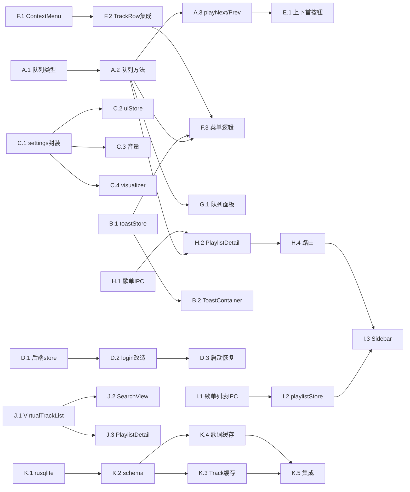

### H. PlaylistDetail 页面（7 点）

- [ ] **H.1** 歌单数据获取 — 后端 IPC（2点）
  - 新建 command：`get_playlist_detail(id, source)` — `src-tauri/src/commands/mod.rs`
  - 返回 `Playlist { id, name, description, coverUrl, tracks: Vec<Track> }`
  - `crates/core/src/lib.rs` 新增 `Playlist` 结构体
  - MusicSource trait 新增 `get_playlist_detail(&self, id: &str)`（默认 Unimplemented）
  - netease/qqmusic crate 实现（或先 stub）
  - 前端 `lib/ipc.ts` 新增 `getPlaylistDetail(id, source)`
  - 注册到 main.rs invoke_handler
  - 验收：前端可通过 IPC 获取歌单详情

- [ ] **H.2** PlaylistDetailView 页面（3点） — 新建 `frontend/src/views/PlaylistDetailView.tsx`
  - 路由：`/playlist/:source/:id`
  - PlaylistHeader：封面(160x160 rounded-xl) + 标题 + 描述 + 歌曲数 + "播放全部" + "随机播放"
  - 播放全部 → `clearQueue` + `addToQueue(tracks)` + `playFromQueue(0)`
  - 随机播放 → 同上 + `setPlayMode('shuffle')`
  - 歌曲列表复用 TrackRow | 加载态：skeleton
  - 依赖：H.1, A.2
  - 验收：页面渲染正确，播放全部/随机可用

- [ ] **H.3** BackButton 组件（1点） — 新建 `frontend/src/components/common/BackButton.tsx`
  - sticky top-0，`useNavigate(-1)` 返回，ChevronLeft 图标
  - 验收：点击返回上一页

- [ ] **H.4** 路由注册（1点） — 修改 `frontend/src/App.tsx`
  - 新增 `<Route path="/playlist/:source/:id" element={<PlaylistDetailView />} />`
  - 验收：URL 导航到歌单页面

### I. Sidebar 歌单列表（5 点）

- [ ] **I.1** 歌单列表数据获取 — 后端 IPC（2点）
  - 新建 command：`get_user_playlists(source)` — `src-tauri/src/commands/mod.rs`
  - 返回 `Vec<PlaylistBrief { id, name, coverUrl, trackCount }>`
  - `crates/core/src/lib.rs` 新增 `PlaylistBrief` 结构体 + MusicSource trait 新增方法
  - 前端 `lib/ipc.ts` 新增 `getUserPlaylists(source)`
  - 验收：前端可获取用户歌单列表

- [ ] **I.2** playlistStore（1点） — 新建 `frontend/src/store/playlistStore.ts`
  - 状态：`playlists: PlaylistBrief[]`、`loading: boolean`
  - 方法：`fetchPlaylists()` 合并两个源的歌单
  - App.tsx 启动时调用
  - 验收：store 可获取并存储歌单列表

- [ ] **I.3** Sidebar 歌单渲染（2点） — 修改 `frontend/src/components/layout/Sidebar.tsx`
  - 导航项下方 `border-t` + 歌单列表
  - PlaylistNavItem：24x24 封面 + 歌单名(truncate)，折叠时只显示缩略图
  - 点击 → `navigate(/playlist/${source}/${id})`
  - 依赖：I.2, H.4
  - 验收：Sidebar 显示歌单，点击跳转

---

## Phase 3：优化增强（12 点）

### J. 虚拟滚动（4 点）

- [ ] **J.1** VirtualTrackList 组件（2点） — 新建 `frontend/src/components/common/VirtualTrackList.tsx`
  - `@tanstack/react-virtual` useVirtualizer，estimateSize 52px，overscan 5
  - Props: `{ tracks: Track[] }`，内部复用 TrackRow
  - 验收：1000+ 条目滚动流畅，DOM 节点数恒定

- [ ] **J.2** SearchView 集成（1点） — 修改 `frontend/src/views/SearchView.tsx`
  - 替换 `results.map(TrackRow)` → `<VirtualTrackList tracks={results} />`
  - 验收：搜索结果虚拟滚动

- [ ] **J.3** PlaylistDetailView 集成（1点） — 修改 `frontend/src/views/PlaylistDetailView.tsx`
  - 歌曲列表使用 VirtualTrackList
  - 验收：歌单详情虚拟滚动

### K. SQLite 持久化（8 点）

- [ ] **K.1** 添加 rusqlite 依赖（1点） — `src-tauri/Cargo.toml`
  - `rusqlite = { version = "0.31", features = ["bundled"] }`
  - 验收：编译通过

- [ ] **K.2** DB 初始化与 schema（2点） — 新建 `src-tauri/src/db.rs`
  - app_data_dir 下 `rustplayer.db`
  - 表：`tracks(id, source, name, artist, album, duration_ms, cover_url, cached_at)`
  - 表：`lyrics(track_id, source, lines_json, cached_at)`
  - `Db` 结构体 + `open()` + `init_tables()`，main.rs setup 中 `app.manage(Arc<Db>)`
  - 验收：启动自动建表

- [ ] **K.3** Track 缓存读写（2点） — `src-tauri/src/db.rs`
  - `cache_tracks` INSERT OR REPLACE / `get_cached_tracks` SELECT LIKE
  - 7天过期
  - 验收：track 可写入读出

- [ ] **K.4** 歌词缓存读写（1点） — `src-tauri/src/db.rs`
  - `cache_lyrics` JSON序列化 / `get_cached_lyrics` 反序列化
  - 验收：歌词可写入读出

- [ ] **K.5** 集成到 commands（2点） — `src-tauri/src/commands/mod.rs`
  - search_music / get_lyrics：内存LRU > SQLite > API
  - 验收：二次请求命中缓存

---

## 4. 依赖关系图

### 并行策略

| 阶段 | 可并行组 |
|------|----------|
| Phase 1 | A ∥ B ∥ C ∥ D（四模块完全独立） |
| Phase 2 | E ∥ F ∥ G ∥ H+I（均依赖 Phase1 A 完成；F.3 额外依赖 B） |
| Phase 3 | J ∥ K（完全独立） |

### 关键依赖链

| 任务 | 依赖于 | 原因 |
|------|--------|------|
| E.1 | A.3 | 按钮绑定需要 playNext/playPrev |
| F.3 | A.2 + B.1 | 菜单操作需要队列方法 + toast |
| G.1 | A.2 | 面板操作依赖队列 store |
| H.2 | H.1 + A.2 | 页面需要后端数据 + 队列方法 |
| I.3 | I.2 + H.4 | Sidebar 需要歌单数据 + 路由 |
| D.3 | D.2 | 启动恢复依赖 login 改造 |
| K.5 | K.3 + K.4 | 集成依赖缓存读写 |

---

## 5. 文件清单

### 新建（12 个）
| 文件 | 模块 |
|------|------|
| `frontend/src/store/toastStore.ts` | B |
| `frontend/src/store/playlistStore.ts` | I |
| `frontend/src/lib/settings.ts` | C |
| `frontend/src/components/common/ToastContainer.tsx` | B |
| `frontend/src/components/common/ContextMenu.tsx` | F |
| `frontend/src/components/common/BackButton.tsx` | H |
| `frontend/src/components/common/VirtualTrackList.tsx` | J |
| `frontend/src/components/player/QueuePanel.tsx` | G |
| `frontend/src/views/PlaylistDetailView.tsx` | H |
| `src-tauri/src/store.rs` | D |
| `src-tauri/src/login_window.rs` | D |
| `src-tauri/src/db.rs` | K |

### 修改（14 个）
| 文件 | 模块 | 变更 |
|------|------|------|
| `frontend/src/store/playerStore.ts` | A,C | 队列 + 音量持久化 |
| `frontend/src/store/uiStore.ts` | C | 主题持久化 |
| `frontend/src/store/visualizerStore.ts` | C | 迁移 plugin-store |
| `frontend/src/lib/ipc.ts` | H,I | 歌单 IPC |
| `frontend/src/App.tsx` | A,B,G,H,I | 事件/组件/路由/启动 |
| `frontend/src/components/layout/PlayerBar.tsx` | E,G | 上下首 + 队列按钮 |
| `frontend/src/components/layout/Sidebar.tsx` | I | 歌单列表 |
| `frontend/src/components/common/TrackRow.tsx` | F | 右键菜单 |
| `frontend/src/views/SearchView.tsx` | J | 虚拟滚动 |
| `frontend/src/views/SettingsView.tsx` | D | 登录UI改造 |
| `src-tauri/src/main.rs` | D,K | Cookie恢复 + DB初始化 |
| `src-tauri/src/commands/mod.rs` | D,H,I,K | 新command + 缓存 |
| `src-tauri/Cargo.toml` | K | rusqlite |
| `crates/core/src/lib.rs` | H,I | Playlist 类型 |

---

## 6. 风险与缓解

| 风险 | 影响 | 缓解 |
|------|------|------|
| 歌单 API 需登录态 | 高 | H/I 依赖 D 完成；未登录显示提示 |
| shuffle 增删队列致 shuffleOrder 失效 | 中 | 增删时重新生成，保持当前位置 |
| SQLite 并发写入 | 中 | `Mutex<Connection>` 串行化 |
| 虚拟滚动 + 右键菜单定位冲突 | 低 | ContextMenu fixed + viewport 检测 |
| plugin-store JS 绑定版本 | 低 | 锁定 `@tauri-apps/plugin-store@^2` |

---

## 7. 验收标准

- [ ] 28 个子任务全部完成
- [ ] 三种播放模式切歌正确，播放结束自动切歌
- [ ] 右键菜单四项功能 + toast 反馈
- [ ] 设置（主题/音量/可视化）重启恢复
- [ ] Cookie 重启免登录
- [ ] 歌单页面浏览 + 播放全部/随机
- [ ] 虚拟滚动 1000+ 条目流畅
- [ ] SQLite 缓存命中无网络请求
