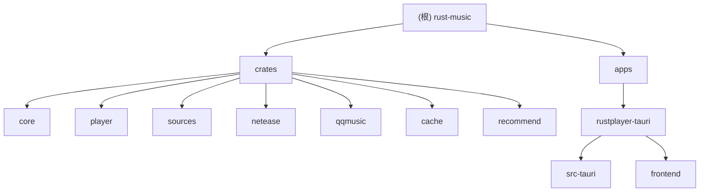

# 拾音 (RustPlayer) - 项目文档

## 变更记录 (Changelog)

| 时间 | 操作 | 说明 |
|------|------|------|
| 2026-03-15T11:22:14 | 增量更新 | 新增 recommend 引擎、沉浸模式、FM 电台、行为追踪、IPC 重试、每日推荐页 |
| 2026-02-27T16:32:02 | 增量更新 | 新增 traceId 链路追踪、结构化日志、错误消息国际化、WebView 登录窗口 |
| 2026-02-24T22:48:14 | 初始化 | 首次全仓扫描，生成根级及模块级 CLAUDE.md |

## 项目愿景

拾音 (ShiYin) 是一个 Linux 桌面端 GUI 音乐播放器，使用 Rust + Tauri v2 构建，支持网易云音乐和 QQ 音乐双音源，具备 Spotify 风格的现代界面、频谱可视化、歌词同步显示、动态主题色提取、本地推荐引擎和沉浸式播放模式。

## 架构总览

- 后端：Rust workspace，包含 7 个 crate（core / player / sources / netease / qqmusic / cache / recommend）+ 1 个 Tauri 应用 crate
- 前端：React 18 + TypeScript + Vite + Tailwind CSS + Zustand 状态管理
- 音频引擎：GStreamer (gstreamer-rs)，独立线程运行，通过 tokio channel 与主线程通信
- 推荐引擎：本地混合重排序算法（平台排名 30% + 艺术家偏好 50% + 新鲜度 20%），支持隐式行为追踪和无限电台
- IPC：Tauri v2 command/event 双向通信，所有调用携带 traceId 用于端到端链路追踪，网络/限流错误自动重试（指数退避，最多 2 次）
- 持久化：tauri-plugin-store (配置/凭据) + SQLite/rusqlite (搜索缓存、歌词缓存、播放事件) + 内存 LRU (热缓存)
- 日志系统：tracing + tracing-subscriber，JSON Lines 格式落盘，按天滚动，保留 7 天

## 模块结构图



## 模块索引

| 模块路径 | 语言 | 职责 |
|----------|------|------|
| `crates/core` | Rust | 通用类型定义（Track, PlayerState, MusicSource trait, PlayEvent, ArtistPreference, RecommendResult, 错误类型） |
| `crates/player` | Rust | GStreamer 音频播放引擎，状态机管理，频谱分析 |
| `crates/sources` | Rust | 音乐源注册表 (SourceRegistry)，统一管理多音源 |
| `crates/netease` | Rust | 网易云音乐 API 客户端（weapi 加密、搜索、播放、歌词、歌单、每日推荐、私人 FM） |
| `crates/qqmusic` | Rust | QQ 音乐 API 客户端（签名计算、搜索、播放、歌词、凭据自动刷新、每日推荐、私人 FM） |
| `crates/cache` | Rust | 内存 LRU 搜索缓存（5 分钟 TTL，128 容量） |
| `crates/recommend` | Rust | 本地推荐引擎（用户画像构建、混合重排序、艺术家推荐、重温经典） |
| `apps/rustplayer-tauri/src-tauri` | Rust | Tauri 应用入口，IPC commands，事件转发，SQLite 持久缓存/行为追踪，Cookie/凭据存储，traceId 生成 |
| `apps/rustplayer-tauri/frontend` | TypeScript/React | 前端 UI（搜索、播放控制、歌词、频谱可视化、歌单、每日推荐、沉浸模式、FM 电台、设置） |

## 运行与开发

### 系统依赖

```bash
sudo apt install -y \
  libwebkit2gtk-4.1-dev libgtk-3-dev libayatana-appindicator3-dev \
  libgstreamer1.0-dev libgstreamer-plugins-base1.0-dev \
  gstreamer1.0-plugins-good gstreamer1.0-plugins-bad gstreamer1.0-plugins-ugly \
  libasound2-dev libssl-dev pkg-config
```

### 开发启动

```bash
# 前端依赖安装
cd apps/rustplayer-tauri/frontend && npm install

# 开发模式（在项目根目录）
cargo tauri dev

# 生产构建
cargo tauri build
```

### 前端单独开发

```bash
cd apps/rustplayer-tauri/frontend
npm run dev      # Vite dev server on :1420
npm run build    # 生产构建
```

## 测试策略

- Rust 单元测试：`crates/recommend/src/normalize.rs` 中已有 4 个测试（`normalize_artist` 基本功能、中文、分隔符、空字符串）
- 建议补充的 Rust 单元测试：weapi 加密 (`crates/netease/src/crypto.rs`)、QQ 音乐签名 (`crates/qqmusic/src/sign.rs`)、LRC 歌词解析、缓存 TTL 逻辑、`rerank` 算法、`build_profile` 逻辑
- Rust 集成测试：使用 wiremock 模拟 HTTP 响应，测试 API 客户端
- 前端测试：Vitest + Testing Library，测试 Zustand store 逻辑和组件渲染
- E2E 测试：Tauri test utils，验证 IPC command/event 契约

## 编码规范

- Rust edition 2021，workspace resolver v2
- 前端 TypeScript strict 模式，`noUnusedLocals` + `noUnusedParameters`
- 路径别名：前端使用 `@/*` 映射到 `src/*`
- 状态管理：Zustand store 按功能拆分（player / ui / visualizer / toast / playlist / fm / recommend）
- IPC 封装：所有 Tauri invoke 调用集中在 `frontend/src/lib/ipc.ts`，每次调用自动生成 traceId，网络/限流错误自动重试（指数退避，最多 2 次）
- 错误处理：Rust 端使用 thiserror 派生错误类型，统一映射为 IpcError（结构化 JSON），前端通过 `sanitizeError()` 转换为用户友好消息
- 序列化：Rust 使用 serde camelCase 与前端 TypeScript 对齐
- 日志规范：所有 IPC command 通过 `run_with_trace()` 包装，自动记录 traceId 和执行结果
- 性能规范：频谱数据通过 `spectrumDataRef`（共享 Float32Array）绕过 Zustand 避免 ~15fps 重渲染；播放进度条使用 RAF 60fps 本地插值；沉浸模式 Canvas 以 75% 分辨率渲染、30fps 帧限

## AI 使用指引

- 修改后端类型时，同步更新 `crates/core/src/lib.rs` 和 `frontend/src/lib/ipc.ts` 中的类型定义
- 新增 Tauri command 时，需在 `src-tauri/src/commands/mod.rs` 实现并在 `main.rs` 的 `generate_handler!` 中注册
- 新增音乐源时，实现 `MusicSource` trait（包括 `get_daily_recommend` 和 `get_personal_fm`）并在 `main.rs` 中 `registry.register()`
- GStreamer 播放引擎运行在独立线程，通过 `mpsc::channel` 接收命令、`broadcast::channel` 发送事件
- 前端事件监听在 `App.tsx` 的 `useEffect` 中统一注册
- 搜索采用三级缓存：L1 内存 LRU -> L2 SQLite -> L3 API 请求
- 新增 IPC command 时，确保在 `run_with_trace()` 中包装，并接受 `trace_id: Option<String>` 参数
- 前端错误消息通过 `sanitizeError()` 统一处理，开发环境显示详细信息，生产环境显示用户友好消息
- WebView 登录窗口使用 webkit2gtk CookieManager API 提取 HttpOnly Cookie（Linux 平台）
- 行为追踪：`playerStore.ts` 在播放/切歌/清队列时自动调用 `flushPlayEvent()` 上报播放事件，完成判定为播放 >= 80% 或 >= 时长 - 10s
- 推荐引擎：`get_smart_recommend` 聚合双音源每日推荐后通过 `recommend` crate 重排序，需要至少 10 条播放事件才启用个性化排序
- 无限电台：`autoReplenish()` 在队列剩余 <= 2 首时自动拉取，使用 `getRadioBatch` 排除当前队列中的曲目
- 路由代码分割：`SettingsView`、`PlaylistDetailView`、`DailyRecommendView` 使用 `React.lazy()` 懒加载
- QQ 音乐凭据刷新：`QqMusicClient` 在 401 错误时自动尝试 `try_refresh()`，成功后通过 `on_refresh` 回调持久化新凭据
