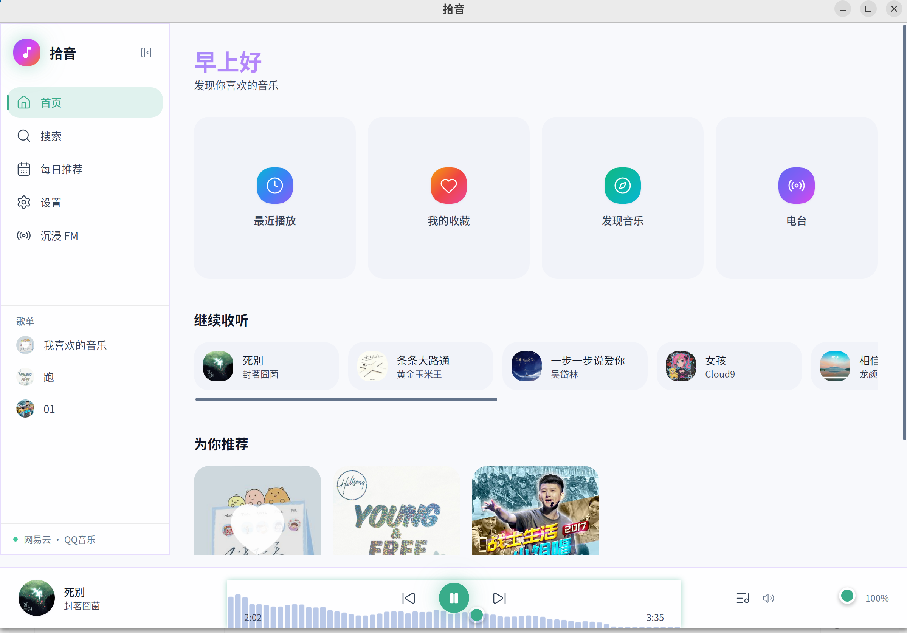
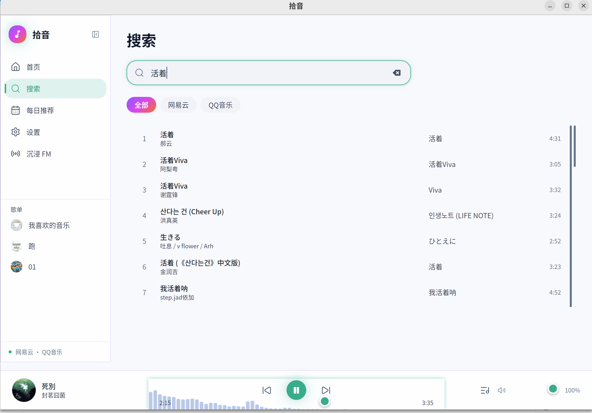
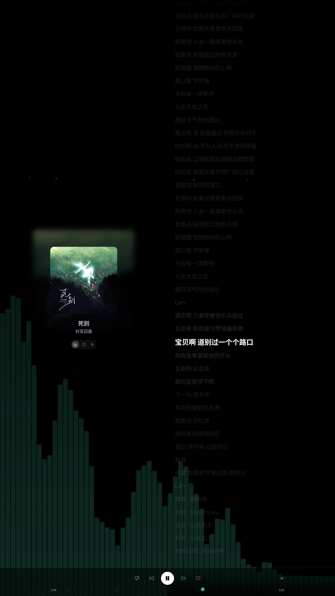

# ShiYin Player (拾音)

A modern desktop music player built with **Rust + Tauri v2**, featuring dual music source support (NetEase Cloud Music & QQ Music), real-time spectrum visualization, synchronized lyrics, and dynamic theme colors extracted from album artwork. Designed for Linux with a Spotify-inspired UI.

> 基于 Rust + Tauri v2 的 Linux 桌面音乐播放器，支持网易云音乐和 QQ 音乐双音源聚合搜索与播放。

## 功能特性

- **聚合搜索** — 同时搜索网易云音乐和 QQ 音乐，三级缓存（内存 LRU → SQLite → API）
- **在线播放** — GStreamer 音频引擎，独立线程运行，支持播放队列与多种播放模式
- **歌词同步** — 逐行歌词滚动显示，支持翻译歌词
- **频谱可视化** — 柱状 / 波形 / 环形三种模式，粒子效果，自定义配色
- **动态主题色** — 从当前播放封面提取主色调，动态设置全局主题色
- **一键登录** — WebView 扫码登录，自动提取 HttpOnly Cookie（Linux 通过 webkit2gtk 原生 API）
- **Cookie 登录** — 手动粘贴 Cookie 登录，获取歌单等高级权限
- **歌单管理** — 查看和播放用户歌单
- **键盘快捷键** — 空格播放/暂停、方向键调节音量和进度、Ctrl+B 切换侧边栏
- **明暗主题** — 深色 / 浅色主题切换
- **结构化日志** — tracing 日志系统，按天滚动，支持 traceId 端到端链路追踪
- **安全加固** — CSP 策略、域名白名单、Cookie 验证、输入校验
- **智能推荐** — 本地混合重排序引擎（平台排名 + 艺术家偏好 + 新鲜度），基于隐式行为追踪构建用户画像
- **沉浸模式** — 原生全屏沉浸式播放，隐藏系统标题栏，专注聆听体验
- **私人 FM 电台** — 无限电台模式，队列剩余不足时自动补充，智能去重
- **每日推荐** — 聚合双音源每日推荐，个性化重排序

## 界面预览

### 主界面



### 音乐搜索



### 每日推荐


### 沉浸模式



## 技术栈

| 层级 | 技术 |
|------|------|
| 框架 | Tauri v2 |
| 前端 | React 18 + TypeScript + Tailwind CSS + Zustand |
| 后端 | Rust (Cargo Workspace, 7 crates) |
| 音频 | GStreamer (gstreamer-rs) |
| 虚拟滚动 | @tanstack/react-virtual |
| 持久化 | tauri-plugin-store + SQLite (rusqlite + r2d2) |
| 加密 | AES-128-CBC + RSA (网易 weapi) / MD5 签名 (QQ) |

## 项目结构

```
rust-music/
├── apps/rustplayer-tauri/
│   ├── frontend/            # React 前端
│   │   └── src/
│   │       ├── components/    # UI 组件 (layout / player / common)
│   │       ├── views/         # 页面 (Home / Search / Settings / PlaylistDetail / DailyRecommend)
│   │       ├── store/         # Zustand stores (player / ui / visualizer / toast / playlist / fm / recommend)
│   │       ├── hooks/         # 自定义 hooks (useDynamicTheme / useFocusTrap)
│   │       └── lib/           # IPC 封装 / 设置持久化 / 工具函数
│   └── src-tauri/           # Rust 后端
│       └── src/
│           ├── main.rs        # 应用入口与初始化
│           ├── commands/      # Tauri IPC 命令
│           ├── events.rs      # 播放器事件转发
│           ├── db.rs          # SQLite 持久缓存 + 行为追踪
│           ├── logging.rs     # 日志系统初始化
│           └── store.rs       # Cookie 持久化
├── crates/
│   ├── core/                # 核心类型 (Track, PlayerState, MusicSource trait, PlayEvent)
│   ├── player/              # GStreamer 播放引擎 + 频谱分析
│   ├── sources/             # 音源注册中心 (SourceRegistry)
│   ├── netease/             # 网易云音乐 API (weapi 加密)
│   ├── qqmusic/             # QQ 音乐 API (签名计算)
│   ├── cache/               # 内存 LRU 搜索缓存 (5min TTL)
│   └── recommend/           # 本地推荐引擎 (用户画像 + 混合重排序)
└── Cargo.toml               # Workspace 配置
```

## 环境要求

- Rust 1.75+
- Node.js 18+
- GStreamer 1.20+ 开发库
- Tauri v2 CLI

### Linux (Ubuntu/Debian)

```bash
# 系统依赖
sudo apt install -y \
  libwebkit2gtk-4.1-dev libgtk-3-dev libayatana-appindicator3-dev \
  libgstreamer1.0-dev libgstreamer-plugins-base1.0-dev \
  gstreamer1.0-plugins-good gstreamer1.0-plugins-bad gstreamer1.0-plugins-ugly \
  libasound2-dev libssl-dev pkg-config

# Tauri CLI
cargo install tauri-cli --version "^2"
```

## 构建与运行

```bash
# 前端依赖
cd apps/rustplayer-tauri/frontend && npm install && cd -

# 开发模式
cargo tauri dev

# 生产构建
cargo tauri build
```

## 快捷键

| 按键 | 功能 |
|------|------|
| `Space` | 播放 / 暂停 |
| `↑` / `↓` | 音量 +/- 5% |
| `←` / `→` | 快退 / 快进 5 秒 |
| `Ctrl+B` | 切换侧边栏 |

## 后续计划

- [ ] **增加音源** — 接入更多音乐平台（如咪咕音乐、酷狗音乐等），丰富曲库覆盖
- [ ] **签到功能** — 支持网易云音乐和 QQ 音乐每日签到，自动领取积分/成长值

## License

[MIT](./LICENSE)
