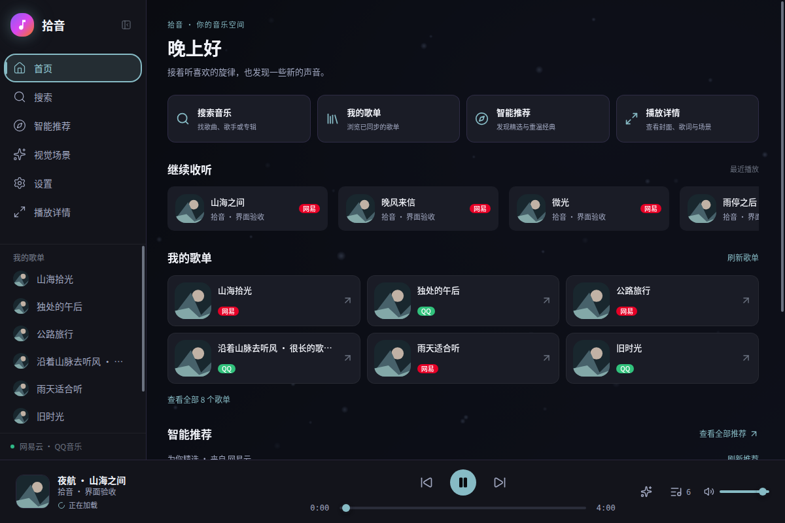
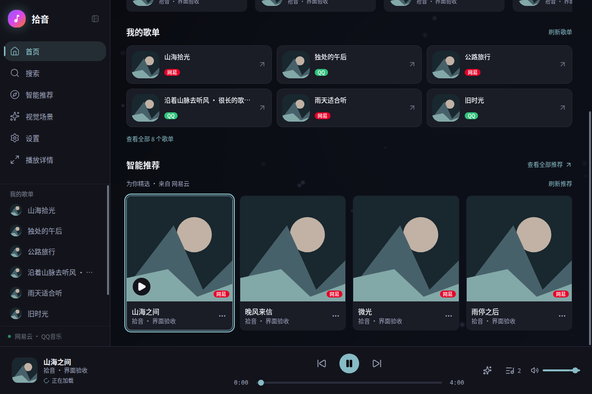
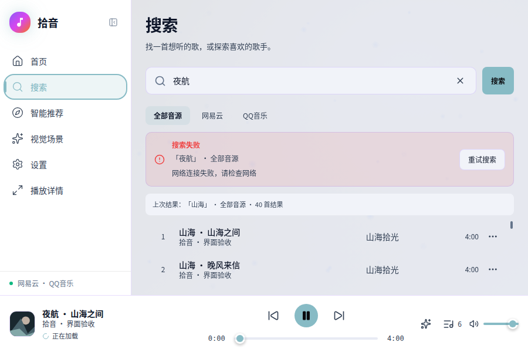
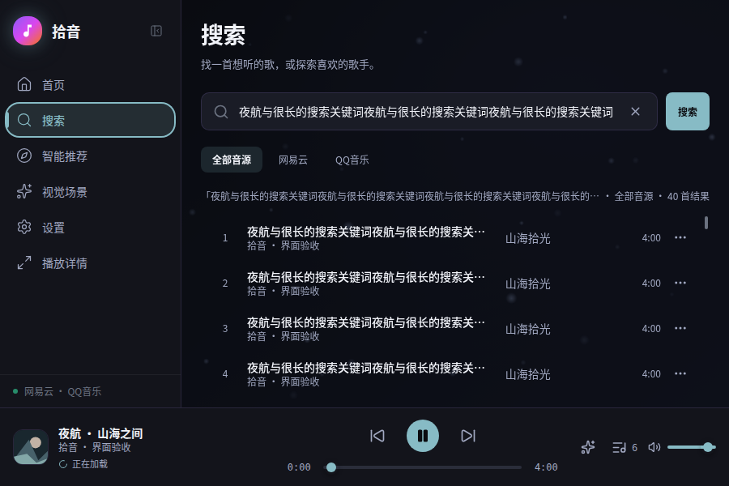

# 首页、导航与搜索反馈验证

验证日期：2026-09-06。开发分支 `codex/home-navigation-search`，基于 `49dd940`。实现行为见 [页面方案](home-navigation-search.md)。本轮尚未合并或发布。

## 结果

| 检查 | 结果 |
| --- | --- |
| 前端回归 | 11 个文件、105 项通过，包含本轮新增 22 项 |
| Rust 回归 | `cargo test --workspace --locked --offline`，52 项通过 |
| 生产构建 | TypeScript strict 检查与 Vite 构建通过 |
| diff 格式 | `git diff --check` 通过 |
| Chromium 152.0.7977.82 | 24 项功能检查、36 个窗口/主题/页面状态组合通过 |
| WebKitGTK 2.52.6 | 两个窗口各 24 项功能检查；合计 36 个窗口/主题/页面状态组合通过 |
| Chromium 原生键盘 | Enter 定位歌单标题，Tab 进入刷新按钮；Space 播放推荐单曲仅产生一次请求并保留队列；横向滚动按钮聚焦后可见；搜索 Enter 在防抖到期前提交且不重复请求 |

窗口矩阵为 1200×800、900×600 × 深色、浅色 × 首页有数据、未登录、空数据、获取失败，以及搜索成功、失败保留旧结果、空结果、加载、超长关键词。所有组合未出现页面横向溢出，搜索与导航的主要控件未超出可操作区域。最小窗口的失败提示与旧结果区仍保留可滚动歌曲列表。

## 功能覆盖

- 我的歌单入口定位并聚焦集合标题；展开八个歌单后打开指定歌单；进入歌单不触发播放。
- 首页与侧栏使用“播放详情”；展开和折叠侧栏都可打开现有沉浸面板；焦点进入弹层，退出回到原入口；当前队列不变。
- 推荐卡片读取推荐歌曲，歌单单独展示；登录、空歌单、空推荐、获取失败与重试具有明确反馈；推荐降级和仅有重温经典的状态由组件回归覆盖。
- 真实虚拟列表可滚动到后面的歌曲；新请求失败时保留上次结果及其滚动位置，标明各自关键词和音源；重试成功后切换上下文并回到新列表顶部。
- 搜索单曲保留当前队列；音源方向键移动焦点并更新请求；迟到旧响应不覆盖新词；清空在途请求后恢复输入前状态和输入焦点。
- 单元回归进一步覆盖中文组合输入、纯空白、取消防抖、旧成功/失败、多个实例、搜索失败持久可见，以及登录检查失败恢复。
- 横向歌曲入口的滚动按钮在键盘聚焦时显示，减少动态效果偏好下滚动直接完成。

## 截图

默认窗口首页：

首页下部的真实推荐入口与歌曲操作（滚动后）：

最小窗口中的搜索失败、重试和上次结果：

超长搜索词省略显示，音源和数量仍保持可见：

## 复核方式与边界

常规回归命令见 [TESTING.md](../../TESTING.md)。结构化浏览器结果收录于 [验证数据](home-navigation-search-validation.json)。当前工作区的隔离浏览器脚本与全部截图位于 `work/home-search-qa/`：构建前端后运行 `node work/home-search-qa/build.mjs`，以本机端口 1434 提供该目录，再运行 Chromium 脚本和 WebKitGTK 脚本（窗口参数 1200 或 900）。这些工作区脚本不随产品打包。

浏览器验收打包真实 App、路由、组件、虚拟列表和 store，只通过 Tauri 官方 mock API 提供固定账号、曲目、歌单和网络结果。没有读取真实账号或播放在线音频，也没有用本轮功能检查替代平台服务联调、原生安装包验收或压力测试。已有播放生命周期和视觉场景回归仍全部通过。

搜索请求失效后，前端丢弃过期响应；已发给后端的搜索及 IPC 内部重试可能继续完成。本轮没有新增后端取消接口。Radio session、Lyrics read-model、普通集显设备验收与进一步压力测试按原安排保持暂停。
