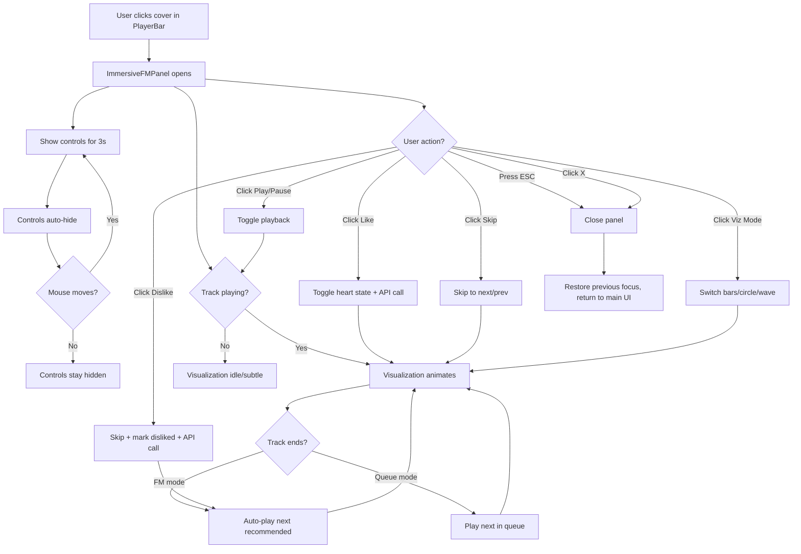

# UI/UX Design: Immersive FM Mode (LyricsPanel Upgrade)

**Date**: 2026-03-07
**Platform**: Linux Desktop (Tauri v2), min 900x600, typical 1200x800
**Tech Stack**: React 18 + TypeScript + Tailwind CSS + Zustand + Canvas 2D
**Designer**: UI/UX Agent

---

## 1. Design Goals

### 1.1 User Goals
- Enjoy an immersive, distraction-free listening experience analogous to a vinyl record player or Spotify canvas
- Watch music-reactive visualizations that respond to the audio in real time
- Read synchronized lyrics without leaving the immersive view
- Discover new music through an FM-style continuous playback flow
- Switch between visualization styles to match personal taste

### 1.2 Business Goals
- Increase average session duration (target: +30% time-in-immersive-view)
- Differentiate from competing Linux music players through visual spectacle
- Create a "showcase feature" that generates word-of-mouth sharing
- FM mode engagement feeds the recommendation engine (like/dislike signals)

---

## 2. Page Structure Design

### 2.1 Layout: Mode A -- Bar Spectrum (Default)

Full-screen overlay. Cover art centered in the upper portion; bar spectrum rises from the bottom edge. Lyrics overlay on the right half. Controls float at the bottom center.

```
+================================================================+
|                                                    [X] close   |
|                                                                |
|                                                                |
|              +------------------+       Lyrics Area            |
|              |                  |       (right half)           |
|              |   Album Cover    |                              |
|              |   320 x 320      |       Previous line...       |
|              |   (glow shadow)  |       >> Active lyric <<     |
|              |                  |       Next line...           |
|              +------------------+                              |
|                                                                |
|              Song Title                                        |
|              Artist Name                                       |
|                                                                |
|         [Viz Mode]                          [progress bar]     |
|                                                                |
|     __|__|_ _|__|__|__|_ _|__|__|__|_ _|__|__|__|_ _|__|_     |
|    |  ||  | ||  ||  ||  | ||  ||  ||  | ||  ||  ||  | ||  |    |
|    |  ||  | ||  ||  ||  | ||  ||  ||  | ||  ||  ||  | ||  |    |
+====|==||==|=||==||==||==|=||==||==||==|=||==||==||==|=||==|====+
|    [ThumbsDown]    [Prev] [Play/Pause] [Next]    [Heart]       |
|                         FM Controls                            |
+================================================================+
```

### 2.2 Layout: Mode B -- Circular Spectrum

Cover art centered with a ring of spectrum bars radiating outward. Lyrics scroll vertically on the right. The cover disc rotates slowly when playing.

```
+================================================================+
|                                                    [X] close   |
|                                                                |
|                                          Lyrics Area           |
|                                          (right 40%)           |
|                  . * . * . * .                                 |
|               *                 *        Previous line...      |
|             *   +-----------+    *                             |
|            *    |           |     *      >> Active lyric <<    |
|           *     |  Cover    |      *                           |
|           *     |  (disc    |      *     Next line...          |
|            *    |  rotates) |     *                            |
|             *   +-----------+    *       ...                   |
|               *                 *                              |
|                  * . * . * .                                   |
|                                                                |
|              Song Title - Artist                               |
|                                                                |
|         [Viz Mode]              [=========|----] progress      |
|                                                                |
|    [ThumbsDown]    [Prev] [Play/Pause] [Next]    [Heart]       |
+================================================================+
```

The `* . *` ring represents spectrum bars drawn radially. Each bar's height maps to a frequency band magnitude, radiating outward from the cover center.

### 2.3 Layout: Mode C -- Waveform Spectrum

Smooth sine-wave-like curves flow horizontally across the full width, behind the cover and lyrics. Multiple layered waves at different opacities create depth.

```
+================================================================+
|                                                    [X] close   |
|                                                                |
|  ~~~~~~~~~~~~~~~~~~~~~~~~~~~~~~~~~~~~~~~~~~~~~~~  Lyrics Area  |
|       ~~~~~~~~~~~~~~~~~~~~~~~~~~~~~~~~~~~~~~~~~~  (right 40%)  |
|              +------------------+                              |
|    ~~~~~~~~~~|                  |~~~~~~~~~~~      prev line    |
|              |   Album Cover    |                              |
|   ~~~~~~~~~~~|   320 x 320      |~~~~~~~~~~      >> Active <<  |
|              |                  |                              |
|    ~~~~~~~~~~+------------------+~~~~~~~~~~~      next line    |
|                                                                |
|  ~~~~~~~~~~~~~~~~~~~~~~~~~~~~~~~~~~~~~~~~~~~~~~~               |
|       ~~~~~~~~~~~~~~~~~~~~~~~~~~~~~~~~~~~~~~~~~~               |
|              Song Title                                        |
|              Artist Name                                       |
|                                                                |
|         [Viz Mode]              [=========|----] progress      |
|                                                                |
|    [ThumbsDown]    [Prev] [Play/Pause] [Next]    [Heart]       |
+================================================================+
```

### 2.4 Region Summary

| Region | Purpose | Priority | Visibility |
|--------|---------|----------|------------|
| Background Canvas | Full-screen visualization rendering | High | Always |
| Album Cover | Track identity, visual anchor | High | Always |
| Track Info | Song title + artist name | High | Always (fades with controls) |
| Lyrics Panel | Synchronized lyric display | High | Always (right portion) |
| FM Controls | Play/pause, skip, like/dislike | High | Auto-hide after 3s idle |
| Progress Bar | Playback position + seek | Medium | Auto-hide with controls |
| Viz Mode Switcher | Toggle between bar/circle/wave | Medium | Auto-hide with controls |
| Close Button | Exit immersive mode | Medium | Auto-hide with controls |
| Particle System | Ambient particles (existing) | Low | Always (behind everything) |

---

## 3. Component Tree

### 3.1 Full Component Hierarchy

```
ImmersiveFMPanel (replaces LyricsPanel)
|
+-- ImmersiveBackground
|   +-- ParticleSystem           (existing, reused)
|   +-- FullscreenVisualizer     (NEW -- dispatches to sub-renderers)
|       +-- BarVisualizerCanvas
|       +-- CircleVisualizerCanvas
|       +-- WaveVisualizerCanvas
|
+-- ImmersiveCover
|   +-- CoverImage               (existing, reused)
|   +-- CoverGlow                (radial gradient glow behind cover)
|
+-- ImmersiveTrackInfo
|   +-- <h2> Song Title
|   +-- <p>  Artist Name
|
+-- ImmersiveLyrics
|   +-- LyricsScroller           (extracted from current LyricsPanel)
|       +-- VirtualLyricLine[]   (@tanstack/react-virtual)
|
+-- ImmersiveControls            (auto-hide overlay)
|   +-- ProgressBar              (thin, full-width)
|   +-- FMControlBar
|   |   +-- DislikeButton
|   |   +-- PrevButton
|   |   +-- PlayPauseButton
|   |   +-- NextButton
|   |   +-- LikeButton
|   +-- VizModeSwitcher
|   +-- CloseButton
```

### 3.2 Component Definitions

---

#### Component: `ImmersiveFMPanel`

**File**: `/home/zty/rust-music/apps/rustplayer-tauri/frontend/src/components/player/ImmersiveFMPanel.tsx`

**Responsibility**: Top-level full-screen modal container. Manages auto-hide timer, mouse movement detection, keyboard shortcuts, and focus trap. Orchestrates all child components.

**Props**:

```typescript
interface ImmersiveFMPanelProps {
  isOpen: boolean;
  onClose: () => void;
}
```

**Internal State**:

```typescript
// Whether controls/close button are visible
const [controlsVisible, setControlsVisible] = useState(true);

// Timer ref for auto-hide (3 second idle)
const hideTimerRef = useRef<ReturnType<typeof setTimeout>>();

// Panel ref for focus trap
const panelRef = useRef<HTMLDivElement>(null);

// Window dimensions for canvas sizing
const [size, setSize] = useState({ w: 1200, h: 800 });
```

**Key Behaviors**:
- `onMouseMove` / `onPointerMove`: reset 3-second auto-hide timer, show controls
- `onMouseLeave`: start auto-hide timer immediately
- Focus trap via existing `useFocusTrap(panelRef, isOpen, onClose)`
- ESC key closes panel (handled by focus trap)
- Body scroll lock when open

**Layout Structure** (JSX skeleton):

```tsx
<div
  ref={panelRef}
  role="dialog"
  aria-label="Immersive FM mode"
  aria-modal="true"
  tabIndex={-1}
  className="fixed inset-0 z-[60] overflow-hidden bg-bg-base"
  onMouseMove={handleMouseMove}
>
  {/* Layer 0: Background visualizer (full bleed) */}
  <ImmersiveBackground width={size.w} height={size.h} />

  {/* Layer 1: Content -- cover + lyrics side by side */}
  <div className="relative z-10 flex h-full">
    {/* Left 60%: Cover + Track Info */}
    <div className="w-[60%] flex flex-col items-center justify-center">
      <ImmersiveCover />
      <ImmersiveTrackInfo />
    </div>

    {/* Right 40%: Lyrics */}
    <div className="w-[40%] flex flex-col">
      <ImmersiveLyrics width={size.w * 0.4} height={size.h} />
    </div>
  </div>

  {/* Layer 2: Controls overlay (auto-hide) */}
  <ImmersiveControls
    visible={controlsVisible}
    onClose={onClose}
  />
</div>
```

---

#### Component: `ImmersiveBackground`

**File**: `/home/zty/rust-music/apps/rustplayer-tauri/frontend/src/components/player/ImmersiveBackground.tsx`

**Responsibility**: Renders the full-screen background layer containing particles and the active visualization mode. All canvases are absolutely positioned and fill the viewport.

**Props**:

```typescript
interface ImmersiveBackgroundProps {
  width: number;
  height: number;
}
```

**Internal Logic**:
- Reads `visualizationMode` from `useVisualizerStore`
- Renders ParticleSystem at reduced opacity (20-30%) as ambient layer
- Conditionally renders one of BarVisualizerCanvas / CircleVisualizerCanvas / WaveVisualizerCanvas based on mode
- All canvases use `aria-hidden="true"`

**Styling**:
```tsx
<div className="absolute inset-0 pointer-events-none" aria-hidden="true">
  {/* Ambient particles */}
  <div className="absolute inset-0 opacity-20">
    <ParticleSystem width={width} height={height} />
  </div>

  {/* Active visualizer */}
  <div className="absolute inset-0 opacity-60">
    <FullscreenVisualizer mode={vizMode} width={width} height={height} />
  </div>
</div>
```

---

#### Component: `FullscreenVisualizer`

**File**: `/home/zty/rust-music/apps/rustplayer-tauri/frontend/src/components/player/FullscreenVisualizer.tsx`

**Responsibility**: Single Canvas 2D component that renders one of three visualization modes. Uses a single `requestAnimationFrame` loop. Reads from `spectrumDataRef` (existing zero-copy shared ref).

**Props**:

```typescript
type VisualizationMode = 'bars' | 'circle' | 'wave';

interface FullscreenVisualizerProps {
  mode: VisualizationMode;
  width: number;
  height: number;
  /** Center coordinates for circle mode (cover center) */
  coverCenter?: { x: number; y: number };
  /** Radius of cover image for circle mode */
  coverRadius?: number;
}
```

**Rendering Logic by Mode**:

1. **`bars` mode**: 64 bars across the bottom 40% of the screen. Bar width = `screenWidth / 64`. Bars use rounded tops. Gradient fill from `--accent` (base) to `--accent-secondary` (top). Reflection effect below baseline at 30% opacity.

2. **`circle` mode**: 64 bars arranged radially around a center point (aligned to cover center). Each bar's base starts at `coverRadius + gap` from center. Bar length = `magnitude * maxBarLength`. Bars point outward. Color cycles through hue based on angle. Glow effect via `ctx.shadowBlur`.

3. **`wave` mode**: Three layered bezier curves. Each curve uses a subset of frequency bands. Curves are drawn with different opacities (0.6, 0.4, 0.2) and slight vertical offsets. Fill area below each curve with semi-transparent accent color. Smooth interpolation between data points using quadratic bezier.

**Performance Considerations**:
- Single canvas, single RAF loop (no per-mode canvas switching)
- Cache `--accent` color every 30 frames (same pattern as existing SpectrumVisualizer)
- `prefers-reduced-motion`: render static gradient bar or single low-opacity line
- Use `ctx.beginPath()` batching for all bars before single `ctx.fill()`

---

#### Component: `ImmersiveCover`

**File**: `/home/zty/rust-music/apps/rustplayer-tauri/frontend/src/components/player/ImmersiveCover.tsx`

**Responsibility**: Renders the album cover image at large scale with dynamic glow effects. In `circle` mode, the cover is circular and rotates slowly (using CSS `animate-spin-slow`). In other modes, it is a rounded rectangle.

**Props**: None (reads from `usePlayerStore` and `useVisualizerStore`)

**Internal State**:

```typescript
const currentTrack = usePlayerStore((s) => s.currentTrack);
const isPlaying = usePlayerStore((s) => s.state === 'playing');
const vizMode = useVisualizerStore((s) => s.visualizationMode);

// Rotation should pause when music is paused
// CSS animation-play-state: paused/running
```

**Sizing**:
- `bars` / `wave` mode: 320x320px rounded-2xl
- `circle` mode: 280x280px fully round (rounded-full), with `animate-spin-slow` when playing

**Glow Effect**: A pseudo-element or sibling div behind the cover that duplicates the cover image, applies `blur(60px)` and `scale(1.1)`, creating a color-matched ambient glow. This uses the existing `--shadow-glow-strong` CSS variable.

```tsx
{/* Glow layer */}
<div
  className="absolute inset-0 scale-110 blur-[60px] opacity-50 rounded-2xl"
  style={{
    backgroundImage: `url(${currentTrack?.coverUrl})`,
    backgroundSize: 'cover',
  }}
  aria-hidden="true"
/>

{/* Actual cover */}

```

---

#### Component: `ImmersiveTrackInfo`

**File**: `/home/zty/rust-music/apps/rustplayer-tauri/frontend/src/components/player/ImmersiveTrackInfo.tsx`

**Responsibility**: Displays current track name and artist below the cover art.

**Props**: None (reads from `usePlayerStore`)

**Markup**:

```tsx
<div className="mt-8 text-center max-w-[400px]">
  <h2 className="text-2xl font-bold text-text-primary truncate">
    {currentTrack?.name ?? 'Unknown Title'}
  </h2>
  <p className="mt-2 text-base text-text-secondary truncate">
    {currentTrack?.artist ?? 'Unknown Artist'}
  </p>
</div>
```

**Transition**: When track changes, apply `animate-fade-in-up` with a key based on `currentTrack.id`.

---

#### Component: `ImmersiveLyrics`

**File**: `/home/zty/rust-music/apps/rustplayer-tauri/frontend/src/components/player/ImmersiveLyrics.tsx`

**Responsibility**: Lyrics display area, extracted from the current LyricsPanel's right-side logic. Virtually identical scroll behavior with @tanstack/react-virtual. The main difference is visual styling:
- No background (transparent, floating over visualization)
- Larger active line font size
- More aggressive blur on non-active lines for "depth of field" effect
- Top/bottom gradient masks to fade lyrics at edges

**Props**:

```typescript
interface ImmersiveLyricsProps {
  width: number;
  height: number;
}
```

**Styling Differences from Current LyricsPanel**:

| Aspect | Current LyricsPanel | Immersive Lyrics |
|--------|-------------------|------------------|
| Background | Solid bg-bg-base | Transparent |
| Active line | text-3xl/4xl, text-accent | text-4xl/5xl, text-text-primary with text-shadow glow |
| Inactive lines | opacity-30 | opacity-20, blur-[2px] |
| Nearby lines | opacity-30, blur-[1px] | opacity-40, blur-[0.5px] |
| Edge masks | from-bg-base/90 | from-black/80 to transparent |
| Container width | 50% screen | 40% screen |

**Active Line Glow**:
```css
.lyric-active {
  text-shadow: 0 0 20px var(--accent-glow), 0 0 40px var(--accent-glow);
}
```

---

#### Component: `ImmersiveControls`

**File**: `/home/zty/rust-music/apps/rustplayer-tauri/frontend/src/components/player/ImmersiveControls.tsx`

**Responsibility**: Auto-hiding overlay containing all interactive elements. Fades in/out based on mouse activity.

**Props**:

```typescript
interface ImmersiveControlsProps {
  visible: boolean;
  onClose: () => void;
}
```

**Layout** (bottom-anchored overlay):

```tsx
<div
  className={cn(
    'absolute inset-0 z-20 flex flex-col justify-end pointer-events-none',
    'transition-opacity duration-500',
    visible ? 'opacity-100' : 'opacity-0',
  )}
  // Allow pointer events only when visible
  style={{ pointerEvents: visible ? 'auto' : 'none' }}
>
  {/* Close button -- top right */}
  <button
    onClick={onClose}
    className="absolute top-6 right-8 w-10 h-10 rounded-full
      bg-bg-secondary/50 backdrop-blur-md flex items-center justify-center
      text-text-secondary hover:text-text-primary hover:bg-bg-hover
      transition-colors duration-200 cursor-pointer pointer-events-auto
      focus-visible:ring-2 focus-visible:ring-accent focus-visible:outline-none"
    aria-label="Exit immersive mode"
  >
    <X size={20} />
  </button>

  {/* Viz mode switcher -- top left */}
  <VizModeSwitcher className="absolute top-6 left-8" />

  {/* Bottom gradient for readability */}
  <div className="h-48 bg-gradient-to-t from-black/70 to-transparent pointer-events-none" />

  {/* Progress bar */}
  <div className="px-12 -mt-4">
    <ImmersiveProgressBar />
  </div>

  {/* FM Control bar */}
  <div className="flex items-center justify-center gap-8 py-6">
    <FMControlBar />
  </div>
</div>
```

---

#### Component: `FMControlBar`

**File**: `/home/zty/rust-music/apps/rustplayer-tauri/frontend/src/components/player/FMControlBar.tsx`

**Responsibility**: Minimal control bar with five buttons: dislike, previous, play/pause, next, like.

**Props**: None (reads from stores, calls IPC)

**Button Specifications**:

| Button | Icon (lucide) | Size | Style | Action |
|--------|--------------|------|-------|--------|
| Dislike | `ThumbsDown` | 20px | Ghost, text-text-secondary | `ipc.dislikeTrack()` + skip to next |
| Previous | `SkipBack` | 24px | Ghost, text-text-primary | `playerStore.playPrev()` |
| Play/Pause | `Play` / `Pause` | 24px | Filled circle 56x56, bg-white text-bg-base | `ipc.togglePlayback()` |
| Next | `SkipForward` | 24px | Ghost, text-text-primary | `playerStore.playNext()` |
| Like | `Heart` | 20px | Ghost; filled red when liked | `ipc.likeTrack()` toggle |

**Play/Pause Button Styling**:
```tsx
<button
  onClick={() => ipc.togglePlayback()}
  className="w-14 h-14 rounded-full bg-white/90 text-bg-base
    flex items-center justify-center
    hover:bg-white hover:scale-105
    active:scale-95
    transition-all duration-200
    shadow-glow-strong
    focus-visible:ring-2 focus-visible:ring-accent focus-visible:outline-none"
  aria-label={isPlaying ? 'Pause' : 'Play'}
>
  {isPlaying ? <Pause size={24} fill="currentColor" /> : <Play size={24} fill="currentColor" className="ml-1" />}
</button>
```

---

#### Component: `VizModeSwitcher`

**File**: `/home/zty/rust-music/apps/rustplayer-tauri/frontend/src/components/player/VizModeSwitcher.tsx`

**Responsibility**: Cycle through visualization modes. Displayed as a small pill-shaped toggle or icon button.

**Props**:

```typescript
interface VizModeSwitcherProps {
  className?: string;
}
```

**Interaction**: Click to cycle `bars -> circle -> wave -> bars`. Display current mode icon and label.

**Icons**:
- `bars`: `BarChart3` (lucide)
- `circle`: `Circle` (lucide) -- or `Disc` for semantic clarity
- `wave`: `Activity` (lucide)

**Markup**:
```tsx
<button
  onClick={() => cycleMode()}
  className="flex items-center gap-2 px-4 py-2
    rounded-full bg-bg-secondary/50 backdrop-blur-md
    text-text-secondary hover:text-text-primary
    transition-colors duration-200 pointer-events-auto
    focus-visible:ring-2 focus-visible:ring-accent focus-visible:outline-none"
  aria-label={`Visualization mode: ${mode}. Click to switch.`}
>
  <ModeIcon size={16} />
  <span className="text-xs font-medium capitalize">{mode}</span>
</button>
```

---

#### Component: `ImmersiveProgressBar`

**File**: `/home/zty/rust-music/apps/rustplayer-tauri/frontend/src/components/player/ImmersiveProgressBar.tsx`

**Responsibility**: Ultra-thin progress bar (2px default, 6px on hover). Reuses the same RAF-based interpolation logic from the existing `PlaybackProgress` component but with a full-width, borderless visual style.

**Styling**:
- Default height: 2px
- Hover height: 6px with smooth transition
- Track color: `rgba(255, 255, 255, 0.15)`
- Progress color: `var(--accent)`
- Thumb: hidden by default, appears on hover (12px circle)
- Time labels: appear on hover, positioned at left/right ends

---

## 4. Interaction Flow

### 4.1 User Journey -- Mermaid Diagram



### 4.2 State Transitions

| Current State | Trigger | Next State | UI Change |
|---------------|---------|------------|-----------|
| Closed | Click PlayerBar cover | Open (controls visible) | Full-screen panel slides up with `animate-scale-in` |
| Controls Visible | 3s mouse idle | Controls Hidden | Controls fade out (opacity 1 -> 0, 500ms) |
| Controls Hidden | Mouse move | Controls Visible | Controls fade in (opacity 0 -> 1, 300ms) |
| Controls Visible | Click close / ESC | Closed | Panel fades out, focus returns to PlayerBar cover |
| Playing | Track ends | Loading next | Cover crossfades, track info transitions |
| Playing | Click pause | Paused | Cover rotation pauses, visualization dampens |
| Paused | Click play | Playing | Cover rotation resumes, visualization intensifies |
| Bars mode | Click viz switcher | Circle mode | Canvas transitions (brief crossfade) |
| Circle mode | Click viz switcher | Wave mode | Canvas transitions |
| Wave mode | Click viz switcher | Bars mode | Canvas transitions |
| Not liked | Click heart | Liked | Heart fills red, scale bounce animation |
| Liked | Click heart | Not liked | Heart outline only, scale bounce |
| Any | Click dislike | Skip to next | Track skips, thumb-down icon briefly animates |

### 4.3 Auto-Hide Logic (Detailed)

```typescript
const HIDE_DELAY = 3000; // 3 seconds

function useAutoHide() {
  const [visible, setVisible] = useState(true);
  const timerRef = useRef<ReturnType<typeof setTimeout>>();

  const show = useCallback(() => {
    setVisible(true);
    clearTimeout(timerRef.current);
    timerRef.current = setTimeout(() => setVisible(false), HIDE_DELAY);
  }, []);

  const hide = useCallback(() => {
    clearTimeout(timerRef.current);
    setVisible(false);
  }, []);

  // Show on mount, start timer
  useEffect(() => {
    show();
    return () => clearTimeout(timerRef.current);
  }, [show]);

  return { visible, show, hide };
}
```

**Edge Cases**:
- If mouse is over a control (button/slider), do NOT auto-hide
- If user is dragging the progress bar, do NOT auto-hide
- Keyboard navigation (Tab) should show controls
- Touch: single tap toggles controls visibility (not applicable for desktop-only, but future-proof)

### 4.4 Keyboard Shortcuts (within ImmersiveFMPanel)

| Key | Action | Notes |
|-----|--------|-------|
| `Escape` | Close panel | Handled by `useFocusTrap` |
| `Space` | Toggle play/pause | Prevent default scroll |
| `ArrowRight` | Seek +5s | Matches main player |
| `ArrowLeft` | Seek -5s | Matches main player |
| `ArrowUp` | Volume +5% | Matches main player |
| `ArrowDown` | Volume -5% | Matches main player |
| `V` | Cycle visualization mode | New shortcut |
| `L` | Toggle like | New shortcut |
| `N` | Next track | New shortcut |
| `P` | Previous track | New shortcut |
| `Tab` | Cycle focus between controls | Shows controls if hidden |

---

## 5. State Management Design

### 5.1 Store Modifications

#### `useVisualizerStore` -- Add visualization mode

**File**: `/home/zty/rust-music/apps/rustplayer-tauri/frontend/src/store/visualizerStore.ts`

```typescript
// Add to existing VisualizerStore interface:
type VisualizationMode = 'bars' | 'circle' | 'wave';

interface VisualizerStore {
  // ... existing fields ...
  visualizationMode: VisualizationMode;
  setVisualizationMode: (mode: VisualizationMode) => void;
  cycleVisualizationMode: () => void;
}

// Add to store implementation:
visualizationMode: 'bars',
setVisualizationMode: (mode) => {
  set({ visualizationMode: mode });
  saveSetting('visualizer.mode', mode).catch(console.error);
},
cycleVisualizationMode: () => {
  const modes: VisualizationMode[] = ['bars', 'circle', 'wave'];
  set((s) => {
    const idx = modes.indexOf(s.visualizationMode);
    const next = modes[(idx + 1) % modes.length];
    saveSetting('visualizer.mode', next).catch(console.error);
    return { visualizationMode: next };
  });
},
```

#### New: `useFMStore` -- FM mode state

**File**: `/home/zty/rust-music/apps/rustplayer-tauri/frontend/src/store/fmStore.ts`

```typescript
import { create } from 'zustand';

interface FMStore {
  /** Whether FM (auto-recommend) mode is active */
  isFMMode: boolean;

  /** Set of track IDs the user has liked in this session */
  likedTrackIds: Set<string>;

  /** Set of track IDs the user has disliked in this session */
  dislikedTrackIds: Set<string>;

  setFMMode: (active: boolean) => void;
  toggleLike: (trackId: string) => void;
  addDislike: (trackId: string) => void;
  isLiked: (trackId: string) => boolean;
}

export const useFMStore = create<FMStore>((set, get) => ({
  isFMMode: false,
  likedTrackIds: new Set(),
  dislikedTrackIds: new Set(),

  setFMMode: (active) => set({ isFMMode: active }),

  toggleLike: (trackId) => set((s) => {
    const next = new Set(s.likedTrackIds);
    if (next.has(trackId)) {
      next.delete(trackId);
    } else {
      next.add(trackId);
    }
    return { likedTrackIds: next };
  }),

  addDislike: (trackId) => set((s) => {
    const next = new Set(s.dislikedTrackIds);
    next.add(trackId);
    // Also remove from liked if present
    const liked = new Set(s.likedTrackIds);
    liked.delete(trackId);
    return { dislikedTrackIds: next, likedTrackIds: liked };
  }),

  isLiked: (trackId) => get().likedTrackIds.has(trackId),
}));
```

### 5.2 Data Flow Diagram

```
spectrumDataRef (Float32Array, mutable ref)
    |
    v
FullscreenVisualizer (reads in RAF loop, no React re-render)
    |
useVisualizerStore.visualizationMode ----> determines render function
    |
usePlayerStore.state ----> controls animation (play/pause)
usePlayerStore.currentTrack ----> cover image, track info, lyrics fetch
usePlayerStore.positionMs ----> lyrics highlight, progress bar
    |
useFMStore.likedTrackIds ----> heart button filled/outline
useFMStore.isFMMode ----> auto-play next recommended on track end
```

### 5.3 Performance Boundaries

To avoid unnecessary React re-renders:

1. **spectrumDataRef**: Already uses mutable ref (bypasses Zustand). The FullscreenVisualizer reads it in its RAF loop -- zero React re-renders for spectrum data.

2. **Lyrics active index**: Computed via `usePlayerStore` selector with binary search -- re-renders only when active line changes (once per lyric line, ~every 2-5 seconds).

3. **Controls visibility**: Local state in `ImmersiveFMPanel`, does NOT flow through Zustand.

4. **Cover glow**: CSS-only, driven by `--shadow-glow-strong` variable transitions. No JS re-renders.

5. **Progress bar**: Same RAF-based interpolation as existing `PlaybackProgress` -- updates DOM directly via refs, zero React re-renders.

---

## 6. Animation & Transition Design

### 6.1 Panel Open/Close

**Open**:
```css
@keyframes immersive-open {
  from {
    opacity: 0;
    transform: scale(0.97);
    backdrop-filter: blur(0px);
  }
  to {
    opacity: 1;
    transform: scale(1);
    backdrop-filter: blur(0px);
  }
}
.animate-immersive-open {
  animation: immersive-open 0.4s cubic-bezier(0.16, 1, 0.3, 1) both;
}
```

**Close**: Reverse of open with 300ms duration. Implemented by toggling a CSS class or conditional rendering with exit animation (consider `animationend` event listener before unmounting).

### 6.2 Controls Auto-Hide

```css
/* Fade in */
.controls-enter {
  transition: opacity 300ms ease-out;
  opacity: 1;
}

/* Fade out */
.controls-exit {
  transition: opacity 500ms ease-in;
  opacity: 0;
}
```

- Cursor hides when controls are hidden: `cursor: none` on the panel
- Cursor reappears when controls show: `cursor: default`

### 6.3 Track Change Transition

When `currentTrack` changes:
1. Cover: crossfade (old cover fades out 300ms, new cover fades in 300ms)
2. Track info: slide up + fade in (`animate-fade-in-up`)
3. Lyrics: fade out old, fade in new (handled by key change on lyrics container)
4. Visualization: brief dampening (lower amplitudes for 200ms, then ramp up)

**Implementation**: Use `key={currentTrack?.id}` on cover and track info wrappers to trigger React's unmount/remount cycle with CSS animations.

### 6.4 Like Button Animation

```css
@keyframes heart-pop {
  0% { transform: scale(1); }
  30% { transform: scale(1.3); }
  60% { transform: scale(0.9); }
  100% { transform: scale(1); }
}
.animate-heart-pop {
  animation: heart-pop 0.4s cubic-bezier(0.175, 0.885, 0.32, 1.275);
}
```

When liked: heart icon transitions from outline (`<Heart />`) to filled (`<Heart fill="currentColor" />`), color transitions from `text-text-secondary` to `text-red-400`, with the pop animation.

### 6.5 Cover Rotation (Circle Mode)

Already exists as `animate-spin-slow` (8s per rotation). Key enhancement:
- When paused, use `animation-play-state: paused` to freeze rotation at current angle (not snap to 0)
- When resuming, rotation continues from where it stopped -- seamless

### 6.6 Visualization Mode Transition

When switching modes, use a brief canvas-level crossfade:
1. Capture current frame as an ImageBitmap
2. Start drawing new mode
3. Blend old frame over new frame with decreasing alpha (300ms)

Simpler alternative (recommended for v1): just swap immediately with a brief opacity dip on the canvas container:
```css
.viz-canvas { transition: opacity 200ms ease; }
/* On mode change: opacity 0 -> draw new mode -> opacity 1 (next frame) */
```

### 6.7 `prefers-reduced-motion` Behavior

| Element | Normal | Reduced Motion |
|---------|--------|----------------|
| Panel open/close | Scale + fade animation | Instant opacity toggle |
| Cover rotation | 8s spin animation | Static (no rotation) |
| Visualizer | 60fps animated bars/waves/circles | Static gradient bar at bottom |
| Controls auto-hide | Opacity transition | Instant show/hide |
| Particle system | Animated particles | No particles (existing behavior) |
| Track change | Crossfade + slide | Instant swap |
| Like heart pop | Bounce animation | Instant color change |
| Progress bar | RAF interpolation | Server-pushed updates only |

---

## 7. Accessibility (A11y)

### 7.1 Focus Management

| Requirement | Implementation |
|-------------|---------------|
| Focus trap | Reuse existing `useFocusTrap(panelRef, isOpen, onClose)` |
| Initial focus | Play/Pause button receives focus on panel open |
| Focus restoration | When panel closes, focus returns to PlayerBar cover button |
| Skip link | Not needed (panel is a modal, not a page) |
| Focus visible | All interactive elements use existing `focus-visible:ring-2 focus-visible:ring-accent` |

### 7.2 ARIA Attributes

```tsx
// Panel container
<div
  role="dialog"
  aria-label="Immersive FM playback mode"
  aria-modal="true"
  tabIndex={-1}
>

// Close button
<button aria-label="Exit immersive mode">

// Play/Pause
<button aria-label={isPlaying ? 'Pause playback' : 'Resume playback'}>

// Like
<button aria-label={isLiked ? 'Remove from favorites' : 'Add to favorites'} aria-pressed={isLiked}>

// Dislike
<button aria-label="Dislike this track and skip">

// Viz mode switcher
<button aria-label={`Visualization: ${mode}. Press to switch.`} aria-roledescription="toggle">

// Progress bar
<input type="range" aria-label="Playback progress" aria-valuemin={0} aria-valuemax={durationMs} aria-valuenow={positionMs} aria-valuetext={`${formatTime(positionMs)} of ${formatTime(durationMs)}`}>

// Lyrics container
<div role="log" aria-label="Synchronized lyrics" aria-live="off">
  // Active lyric line
  <p aria-current="true">{activeLine}</p>
</div>

// Screen reader announcement for track changes
<div role="status" aria-live="polite" className="sr-only">
  Now playing: {trackName} by {artistName}
</div>
```

### 7.3 Keyboard Navigation Order

When controls are visible, Tab order flows:

```
1. Close button (top right)
2. Viz mode switcher (top left)
3. Progress bar (seek slider)
4. Dislike button
5. Previous button
6. Play/Pause button
7. Next button
8. Like button
```

When controls are hidden:
- Any keypress (except media keys) should show controls first
- Tab key shows controls AND moves focus to first element

### 7.4 Color Contrast

All text in the immersive view floats over potentially colorful visualizations. Ensure readability:

| Element | Technique |
|---------|-----------|
| Track title | `text-text-primary` + `text-shadow: 0 2px 8px rgba(0,0,0,0.8)` for contrast |
| Artist name | `text-text-secondary` + same text shadow |
| Active lyric | `text-text-primary` + glow shadow (accent) + large font weight (bold) |
| Inactive lyrics | Already dimmed (opacity 0.2-0.4), acceptable as decorative |
| Control buttons | `bg-bg-secondary/50 backdrop-blur-md` ensures contrast against any background |
| Time labels | `text-text-secondary` + bottom gradient overlay ensures 4.5:1 contrast |

### 7.5 Screen Reader Considerations

- All canvas elements have `aria-hidden="true"` (purely decorative)
- Active lyric line uses `aria-current="true"` for screen reader users who navigate by headings
- Track changes announced via existing `PlayerAnnouncer` component in App.tsx
- Controls visibility state does NOT affect screen reader access -- controls remain in the DOM, only visually hidden via opacity

---

## 8. File Inventory & Development Checklist

### 8.1 New Files to Create

| File | Type | Lines (est.) | Priority |
|------|------|-------------|----------|
| `src/components/player/ImmersiveFMPanel.tsx` | Component | ~120 | P0 |
| `src/components/player/ImmersiveBackground.tsx` | Component | ~40 | P0 |
| `src/components/player/FullscreenVisualizer.tsx` | Component | ~250 | P0 |
| `src/components/player/ImmersiveCover.tsx` | Component | ~80 | P0 |
| `src/components/player/ImmersiveTrackInfo.tsx` | Component | ~30 | P1 |
| `src/components/player/ImmersiveLyrics.tsx` | Component | ~120 | P0 |
| `src/components/player/ImmersiveControls.tsx` | Component | ~80 | P0 |
| `src/components/player/FMControlBar.tsx` | Component | ~90 | P0 |
| `src/components/player/VizModeSwitcher.tsx` | Component | ~40 | P1 |
| `src/components/player/ImmersiveProgressBar.tsx` | Component | ~100 | P1 |
| `src/store/fmStore.ts` | Store | ~50 | P1 |
| `src/hooks/useAutoHide.ts` | Hook | ~30 | P0 |

### 8.2 Existing Files to Modify

| File | Modification | Risk |
|------|-------------|------|
| `src/store/visualizerStore.ts` | Add `visualizationMode`, `setVisualizationMode`, `cycleVisualizationMode` | Low -- additive only |
| `src/App.tsx` | Replace `<LyricsPanel>` with `<ImmersiveFMPanel>` (lazy loaded) | Low -- swap component |
| `src/components/layout/PlayerBar.tsx` | Update `onToggleLyrics` handler (no logic change needed, just naming clarity) | Minimal |
| `src/styles/theme.css` | Add `@keyframes immersive-open`, `heart-pop`; add cursor-hiding rule | Low -- additive |
| `tailwind.config.ts` | Add `immersive-open` and `heart-pop` to animation map | Low -- additive |
| `src/lib/settings.ts` | Persist `visualizer.mode` setting | Low |

### 8.3 Files to Deprecate (Eventually Remove)

| File | Reason |
|------|--------|
| `src/components/player/LyricsPanel.tsx` | Replaced by ImmersiveFMPanel + ImmersiveLyrics |

Note: Keep `LyricsPanel.tsx` available during transition. The new panel subsumes all its functionality.

### 8.4 Existing Components Reused Without Modification

| Component | Usage in Immersive Mode |
|-----------|----------------------|
| `ParticleSystem.tsx` | Background ambient layer |
| `CoverImage.tsx` | Inside ImmersiveCover (fallback handling) |
| `useFocusTrap.ts` | Panel focus management |
| `useDynamicTheme.ts` | Accent color extraction (already global) |
| `PlayerAnnouncer` (in App.tsx) | Screen reader track announcements |

### 8.5 Implementation Order

```
Phase 1 (Core Shell):
  1. useAutoHide hook
  2. ImmersiveFMPanel (container + focus trap + auto-hide)
  3. ImmersiveControls (close button + basic controls)
  4. FMControlBar (play/pause/skip -- reuse existing logic)
  5. Wire into App.tsx, replace LyricsPanel

Phase 2 (Visuals):
  6. ImmersiveCover (cover + glow + rotation)
  7. ImmersiveTrackInfo
  8. FullscreenVisualizer -- bars mode only
  9. ImmersiveBackground (compose particles + visualizer)

Phase 3 (Lyrics + Modes):
  10. ImmersiveLyrics (extract from LyricsPanel)
  11. FullscreenVisualizer -- circle mode
  12. FullscreenVisualizer -- wave mode
  13. VizModeSwitcher
  14. visualizerStore mode additions

Phase 4 (FM Features):
  15. fmStore
  16. Like/Dislike API integration
  17. FM auto-play (recommendation engine hookup)
  18. ImmersiveProgressBar (enhanced from PlaybackProgress)

Phase 5 (Polish):
  19. Track change crossfade animations
  20. prefers-reduced-motion audit
  21. A11y audit (screen reader, keyboard-only testing)
  22. Performance profiling (canvas FPS, memory)
```

---

## 9. Visual Reference: Color & Typography

### 9.1 Immersive Mode Color Palette

The immersive panel uses a darker subset of the existing theme to maximize visualization impact:

```
Panel Background:    #0A0B0F (--bg-base) -- near black
Overlay Gradient:    linear-gradient(to top, rgba(0,0,0,0.7), transparent)
Control Backdrop:    rgba(26, 28, 38, 0.5) + backdrop-blur-md
Text Primary:        #F1F3F9 + text-shadow for contrast
Text Secondary:      #A1A8C1
Accent (dynamic):    var(--accent) -- changes per track via useDynamicTheme
Like Active:         #F87171 (red-400) for filled heart
Dislike Active:      #6B7280 (gray-500) -- muted feedback
```

### 9.2 Typography in Immersive Mode

```
Track Title:      text-2xl (24px), font-bold, text-text-primary
Artist Name:      text-base (16px), font-normal, text-text-secondary
Active Lyric:     text-4xl (36px) / lg:text-5xl (48px), font-bold, text-text-primary
Inactive Lyric:   text-2xl (24px) / lg:text-3xl (30px), text-text-secondary, opacity-20
Time Labels:      text-xs (12px), font-mono, tabular-nums, text-text-secondary
Viz Mode Label:   text-xs (12px), font-medium, text-text-secondary
```

### 9.3 Spacing

```
Panel padding:           0 (full bleed)
Cover to track info:     mt-8 (32px)
Track info to controls:  variable (flex justify-end pushes controls to bottom)
Control buttons gap:     gap-8 (32px) between icon buttons
Controls bottom padding: py-6 (24px)
Progress bar side pad:   px-12 (48px)
Lyrics side padding:     px-10 (40px)
```

---

## 10. Canvas Rendering Specifications

### 10.1 Bar Visualizer (Full-Screen)

```
Bands:           64 (from spectrumDataRef)
Bar width:       screenWidth / 64 - 2px gap
Bar max height:  screenHeight * 0.4
Bar min height:  2px (always visible even at silence)
Bar position:    Bottom-aligned
Bar shape:       Rounded top corners (radius: 3px)
Bar gradient:    Bottom: var(--accent) at 80% opacity
                 Top: var(--accent-secondary) at 60% opacity
Reflection:      Mirror bars below baseline, 30% opacity, scale-y(-0.3)
Smoothing:       Lerp between frames: newVal = oldVal * 0.7 + rawVal * 0.3
```

### 10.2 Circle Visualizer

```
Bands:           64 (from spectrumDataRef)
Center:          Aligned with cover center (typically screen center-left)
Inner radius:    coverRadius + 20px (gap between cover edge and bar start)
Bar max length:  120px outward
Bar width:       At inner edge: 4px; at outer edge: 8px (trapezoid)
Bar distribution: 360 degrees / 64 bars = 5.625 degrees per bar
Bar color:       Hue rotates 360 degrees around the circle
                 Saturation: 80%, Lightness: 65%
Glow:            ctx.shadowBlur = 8, ctx.shadowColor = bar color at 50% alpha
Smoothing:       Same lerp as bars mode
```

### 10.3 Wave Visualizer

```
Layers:          3 wave curves
Layer 1 (front): Bands 0-21 (low freq), opacity 0.5, amplitude * 1.0
Layer 2 (mid):   Bands 21-42 (mid freq), opacity 0.3, amplitude * 0.7, y-offset -30px
Layer 3 (back):  Bands 42-63 (high freq), opacity 0.15, amplitude * 0.4, y-offset -60px
Wave baseline:   screenHeight * 0.55 (slightly below center)
Max amplitude:   screenHeight * 0.15
Curve type:      Quadratic bezier between control points
Fill:            Below each curve, fill with accent color at layer opacity
Stroke:          2px line on each curve at accent color, slightly brighter than fill
Smoothing:       Lerp factor 0.85 (slower, more fluid than bars)
```

### 10.4 Shared Canvas Setup

```typescript
// All visualizer canvases share this DPR-aware setup
const dpr = window.devicePixelRatio || 1;
canvas.width = width * dpr;
canvas.height = height * dpr;
ctx.scale(dpr, dpr);
canvas.style.width = `${width}px`;
canvas.style.height = `${height}px`;
```

---

## 11. Risk Assessment & Mitigations

| Risk | Probability | Impact | Mitigation |
|------|-------------|--------|------------|
| Canvas rendering drops below 60fps on low-end hardware | Medium | High | Implement quality tiers: detect frame drops, reduce band count (64->32), disable glow/reflection |
| Cover glow blur (60px) causes GPU strain | Medium | Medium | Use CSS `will-change: filter` and test on integrated GPUs; fallback to solid color glow |
| Focus trap conflicts with global keyboard shortcuts | Low | Medium | ImmersiveFMPanel's key handler should `stopPropagation()` to prevent App-level handler conflicts |
| FM recommendation API not yet implemented | High | Medium | Phase 4 can use existing queue playback; FM mode is additive, not blocking |
| Track change animation flickers on fast skipping | Medium | Low | Debounce track change transitions (200ms); cancel in-flight animations |
| Like/Dislike API not yet available in backend | High | Medium | Store state locally in fmStore; batch-send to backend when API is ready |
