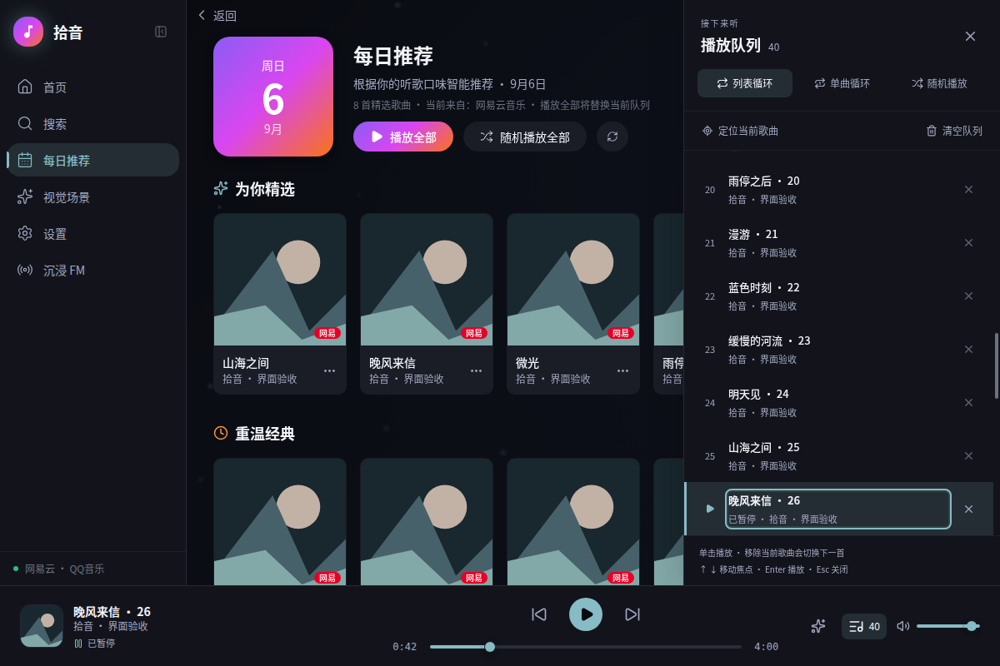
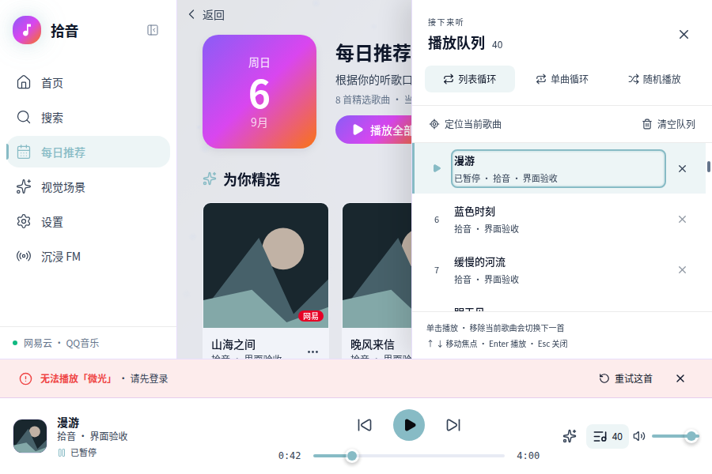

# 播放主流程 UI 验证

日期：2026-09-06。对应 [实现方案](playback-ui-v1.md)，工作分支为 `codex/ui-interaction`。

## 结果

| 检查 | 结果 |
| --- | --- |
| 前端功能回归 | 8 个文件，75 个用例通过；原有 59 个用例保留，新增 16 个 |
| Rust 工作区回归 | 52 个用例通过，包含真实 GStreamer fakesink 管线与事件契约 |
| TypeScript 与 Vite 生产构建 | 通过 |
| Chromium 页面操作 | 14 项检查通过，无前端异常；真实浏览器空格键只发出一次暂停/恢复命令 |
| Chromium 布局 | 1200×800、900×600 × 深浅主题 × 暂停、失败、加载、缓冲，共 16 组；控件无越界、页面无横向溢出，队列底部与播放栏正确衔接 |
| 超长标题 | 最小窗口下，失败歌名省略显示并保留完整悬停提示；播放栏连同恢复区高度仍为 146px，重试与关闭按钮可达 |
| WebKitGTK 2.52.6 页面操作 | 14 项检查通过；覆盖队列虚拟滚动、菜单关闭、失败回滚、重试与沉浸失败提示 |
| WebKitGTK 布局 | 1200×800、900×600 × 深浅主题 × 暂停、失败，共 8 组；以实际 `innerWidth/innerHeight` 确认尺寸，无控件越界或页面横向溢出 |

前端回归命令：

```bash
npm --prefix apps/rustplayer-tauri/frontend test
npm --prefix apps/rustplayer-tauri/frontend run build
cargo test --workspace --locked --offline
```

## 覆盖的行为

- 单曲入口保留并去重队列，当前歌曲可恢复暂停；推荐卡片不再隐式替换队列，双击行内播放按钮不会重复加载。
- 播放全部明确替换队列；迟到停止结果不覆盖后续选择。三种播放模式都尊重一次指定的下一首，移动已有歌曲后保持当前项正确。
- 加载时暂停、缓冲进度、旧歌曲仍在发声的说明、最终失败事实，以及失败回滚后重试正确的歌曲。同曲失败后明确重试也会新建尝试。
- 菜单支持键盘入口、Home/End、Escape 与焦点返回；虚拟队列可用 End 到达屏幕外最后一项，删除后焦点保持在相邻歌曲。
- 清空先显示“清空并停止”；Escape 优先取消确认，完成后停播并显示空状态。无播放尝试时禁用进度条，拖动取消后恢复显示时间和读屏时间。
- 主界面与沉浸模式共用恢复区；超过自动隐藏时限后，沉浸失败恢复入口仍可操作。

## 页面截图

以下为实际生产模式前端组件的 Chromium 截图，使用模拟歌曲、封面与 IPC。

默认窗口、深色主题、暂停与当前歌曲定位：



最小窗口、浅色主题、失败后保留恢复入口：



## 验证范围

页面验收运行真实 App、生命周期和虚拟列表，以 Tauri 的 IPC mock 提供固定歌曲及错误情景；WebKitGTK 使用独立临时 WebView。未使用个人音源账号或真实音频输出，不据此推断联网音源的可用性。后续压力测试继续暂停。

原始检查摘要见 [验证数据](playback-ui-validation.json)。本机页面验收脚本和额外截图保留在 `work/playback-ui-qa/`。WebKitGTK 的最小窗口通过单独以 900×600 启动验证，未把未生效的窗口缩放请求计入覆盖。
