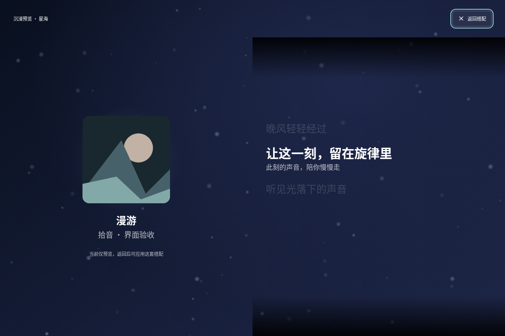

# UI 分支评审收尾

2026-09-06：`codex/ui-interaction` 的规范、需求和交互集成评审已完成，确认的 5 项问题均已修复并通过复核。当前结论为**评审通过，待合并主线**。

## 范围与依据

- 固定基点：`17b9e7d6eb46e48ff2713953e606d46a5cdbaccd`；初次被评审的 HEAD：`a63f7d1`。
- 比较命令：`git diff 17b9e7d6eb46e48ff2713953e606d46a5cdbaccd...HEAD`。
- 原始提交：`71319a1` 视觉场景、`d6290ae` 本机压力测试记录、`a63f7d1` 播放主流程 UI。
- 规范依据：根目录和模块级 `CLAUDE.md`、`TESTING.md`、播放生命周期与视觉场景实现边界。
- 需求依据：[视觉场景首版](visual-scenes-v1.md)、[播放主流程 UI](playback-ui-v1.md)、[开发路线](../roadmap.md)。规范与需求由两条独立评审线检查，修复后分别复核增量。
- 仓库缺少 `docs/agents/issue-tracker.md` 和文档引用的 `.context/prefs/`；本次使用已有设计方案与可读取的规范，不据此推断额外需求。

## Standards

| 编号 | 级别 | 问题、依据与处理 |
| --- | --- | --- |
| S1 | P3，已修复 | 场景规则要求在暂停、加载、缓冲、隐藏及播放尝试变更时清理频谱。原 App 入口只检查实际发声曲目、标识和事件年龄，迟到事件可在清理后重新写入。`lib/scenes/spectrum.ts` 统一可消费条件，App 接收、运行时和 Surface 使用同一播放事实；隐藏、新加载、身份不一致和过期信号均已覆盖。 |

启发式判断与明确违规分别记录：原频谱条件重复已随 S1 收敛。QueuePanel 与 PlaybackStatus 各自解释播放状态的重复仍属维护建议，本轮未发现由它产生的错误反馈，不作为合并阻塞，也不扩展本次修改。

## Spec

| 编号 | 级别 | 问题、依据与处理 |
| --- | --- | --- |
| R1 | P1，已修复 | “下一首播放”要求一次指定优先于随机和单曲循环。原沉浸下一首走 FM 分支，有候选时会清空用户队列。新的 `ImmersiveTransport` 调用统一生命周期的 `playNext`，回归验证指定项消费、队列保留和原播放模式保留。 |
| R2 | P2，已修复 | 方案要求队列有歌曲时播放按钮可以开始。原沉浸播放按钮只检查 `currentTrack`，待播放队列无法启动。现在同时考虑当前歌曲和队列，调用 `togglePlayback`；加载中暂停继续有效。 |
| R3 | P2，已修复 | 沉浸预览要求展示候选背景与歌词布局。原预览只有唱片占位和介绍，且遮罩不同。现在与正式沉浸共用 `ImmersiveContent` 和 immersive 遮罩，展示现有歌词；无歌词时提供明确标注的排版示例。候选仍不会自动应用，退出返回原入口焦点。 |

普通沉浸区域只呈现已实现的上一首、播放/暂停、下一首。原先未形成反馈行为的喜欢/不喜欢按钮不再接入该区域；旧 FM 模块、推荐批次及自动补曲保留，Radio session 重构继续延期。

## 集成补查

**I1，P2，已修复：队列关闭抢走沉浸焦点。** 从队列点击底栏封面后，沉浸弹层先取得焦点，队列在下一次更新关闭，其清理函数又无条件返回旧队列入口。真实 Chromium 复现中 `modal.contains(document.activeElement)` 为 `false`。修复后只有焦点仍属于队列或落到 `body` 才返回原入口；Chromium 与 WebKitGTK 均确认焦点留在沉浸内，退出沉浸返回封面，普通关闭队列仍能正常返回。

## 后续评审修复：预览动画

独立评审确认 `5abd1f2` 在共用沉浸遮罩时引入一项 P2 回归：未播放或暂停时，小预览仍运动，展开后却只绘制初始一帧。根因是 `variant` 同时控制遮罩与预览调度。现已分离为外观 `variant` 和调度 `motion`；小预览和沉浸预览都显式启用预览调度，正式播放背景仍默认跟随实际播放状态。

新增 4 项真实页面/Surface/渲染器回归：修复前 3 项失败、1 项通过，修复后全部通过。Chromium 与 WebKitGTK 另各执行 20 项短时功能检查，确认未播放/暂停时连续绘制，隐藏、减少动态效果和被覆盖时停绘，退出恢复小预览及焦点。原始记录位于 `work/preview-motion-qa/`；WebKitGTK 的小窗口检查先滚动候选区进入视口，避免把正确的屏幕外停绘误判为回归。本轮未运行压力测试。

## 验证

| 检查 | 结果与范围 |
| --- | --- |
| 前端回归 | 8 个文件、79 个用例通过；原 75 个用例保留，新增 4 个，另补充预览歌词断言 |
| 修复前复现 | 两个新增沉浸控制用例失败：误播 FM 候选、待播放按钮被禁用；焦点问题另在真实 Chromium 中复现 |
| Rust 工作区 | 52 个用例通过，含 GStreamer 本地 WAV / fakesink 管线 |
| TypeScript / Vite | 生产构建通过 |
| Chromium 操作 | 原有 14 项与新增 16 项，共 30 项通过，无前端异常；真实空格键只触发一次播放切换 |
| WebKitGTK 2.52.6 操作 | 1200×800、900×600 分别通过上述 30 项检查，无前端异常 |
| 播放栏与队列布局 | Chromium 16 组、WebKitGTK 8 组；无控件越界或横向溢出，队列与底栏衔接正确 |
| 沉浸预览 | Chromium 两种尺寸 × 深浅主题共 4 组，歌词与返回按钮可见且无越界；WebKitGTK 在两个尺寸检查实际歌词与预览几何；预览和正式沉浸遮罩一致 |

```bash
npm --prefix apps/rustplayer-tauri/frontend test
npm --prefix apps/rustplayer-tauri/frontend run build
cargo test --workspace --locked --offline
git diff --check
```

摘要数据见 [评审验证 JSON](ui-branch-review-validation.json)。独立验收脚本和完整原始报告位于当前工作区 `work/ui-review-qa/`，生产应用没有新增测试入口。一次验收脚本在 React 提交前读取了尚未出现的歌词区域；修正等待条件后重新执行，失败脚本的结果未计入通过项。

页面使用生产模式真实 React App、生命周期、歌词组件和虚拟列表，IPC 提供固定歌曲、歌词与频谱。没有使用个人账号或真实音频输出；此次功能验收不是在线音源可用性或性能达标结论。后续压力测试、普通集显设备验收和高分辨率长帧待办保持延期，未在本轮重新压测。

默认窗口的沉浸预览：



最小窗口的沉浸预览：


