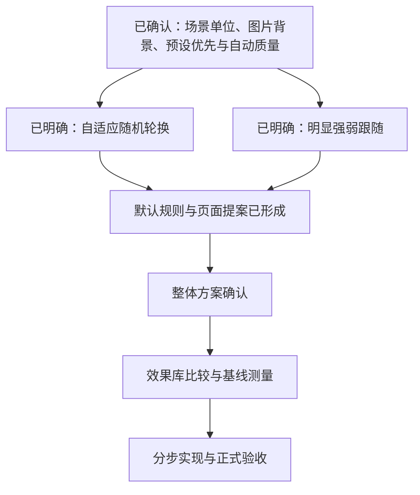

# UI 与交互重构讨论

状态：本文保留设计讨论时的事实与候选方案。用户已整体同意页面和默认规则，正式实现与当前边界以 [视觉场景首版方案](visual-scenes-v1.md) 为准，实测数据见 [验证记录](visual-scenes-validation.md)。下文的原有组件路径和“待确认”描述属于重构前的调查，不代表当前状态。

## 已确认方向

- 本阶段聚焦 UI 与交互。用户明确“高性能”为响应快、流畅、资源占用少，三个维度都要考虑。
- 用户明确特色来自好看的特效、可自定义且可轮换的背景，以及丰富的粒子特效库。
- 用户在上一轮推荐组合后回复“好，继续下一步”，据此确认以下四项：主界面轻量、沉浸界面完整；首版本地图片、渐变与专辑封面；整套视觉场景可保存和轮换；普通集显笔记本 8GB、60Hz 为基础验收档。
- 当前开发机作为更高效果档的测试参考。具体基准设备、CPU/GPU/内存占用与帧时长仍需实测，尚无达标结论。
- 用户本轮回复“Q1：随即 Q2：预设 Q3：自动 Q4：强跟随”。据此记录预设优先、自动质量调整、强音乐跟随；“随即”暂理解为“随机选择场景”，随机的触发时机正在澄清。
- 用户进一步回复“Q1：随机应变 Q4：明显即可”：轮换采用结合播放与操作上下文的自适应随机策略；音画效果明显响应音乐强弱即可，不将精准逐鼓点同步纳入首版目标。
- Radio session 与 Lyrics read-model 开发暂停，见 [开发路线](../roadmap.md)。
- 按 grill-with-docs 分轮讨论；确定术语后更新领域词汇表，具有长期约束且存在真实取舍的决定再记录 ADR。

## 已查清的事实

- 当前产品为 Linux/Tauri 桌面应用，窗口默认 1200×800，最小 900×600。
- 全屏频谱与粒子已经合并到同一 Canvas，内部宽高各为窗口的 75%，绘制上限约 30fps；原生频谱消息约 15Hz，播放进度约 5Hz。帧率上限和像素数的代码设置不等于实测性能收益。
- 频谱通过共享 Float32Array 读取，避免高频 React 状态更新；歌曲列表、队列和沉浸歌词已有虚拟化。
- 当前可达的沉浸路径为 App → ImmersiveFMPanel → ImmersiveBackground → FullscreenVisualizer。LyricsPanel 与独立 ParticleSystem 未被当前界面接入，不作为运行热点。
- 当前开发环境约有 32GB 内存，可见 Intel 集显及 NVIDIA RTX 5070 Laptop GPU；实际 WebView 使用的 GPU、DPR 和屏幕刷新率未核实。这不是已确定的最低目标设备。
- 尚未发现可用于验收的 UI 性能基线报告或专用测量脚本。
- 当前提供 3 种频谱样式、1 种粒子行为和 5 套配色；现有粒子为低频驱动的上浮圆点。没有背景素材库、本地背景导入或轮换功能。详见 [可视化设置](../../apps/rustplayer-tauri/frontend/src/store/visualizerStore.ts)。
- 主色、副色虽然可以选择并持久化，当前全屏频谱实际读取封面提取的 CSS 强调色；自选粒子色有被使用，尚不能将现有设置页视为完整的主题编辑器。
- 可复用设置持久化和部分图片处理基础；本地素材选择、存储与展示需要新增功能，当前没有已接入的背景导入入口。

实现参考：[可视化](../../apps/rustplayer-tauri/frontend/src/components/player/FullscreenVisualizer.tsx)、[频谱共享状态](../../apps/rustplayer-tauri/frontend/src/store/visualizerStore.ts)、[歌曲列表](../../apps/rustplayer-tauri/frontend/src/components/common/VirtualTrackList.tsx)、[沉浸歌词](../../apps/rustplayer-tauri/frontend/src/components/player/ImmersiveLyrics.tsx)、[窗口配置](../../apps/rustplayer-tauri/src-tauri/tauri.conf.json)。

## 初步建议，待确认

根据用户本轮澄清，主轴调整为可定制的背景与粒子效果。第一轮“现代音响器材”的固定视觉方向不再作为当前推荐前提。

视觉场景已确定为背景、粒子效果、配色与强度的组合，以整套场景作为保存、切换和轮换单位。领域定义已加入 [CONTEXT.md](../../CONTEXT.md)，决定见 [ADR 0001](../adr/0001-visual-scenes.md)。用户选择预设优先，首版以选择现成场景、搭配自定义背景和保存为主，不采用完整粒子参数编辑器。

建议首批选择运动和形态明显不同的效果，例如星尘、萤火、雨、雪、流星、泡泡、花瓣与节奏粒子。用户已选择强音乐跟随；具体数量、首发名单与跟随精度仍需落实。

性能建议：效果按需加载；通常只运行当前选定的主效果；效果库优先显示静态缩略图，选中后运行预览；轮换只预备即将使用的资源并回收退出的场景。切换和预览期间的峰值占用应计入验收。主界面轻量、沉浸界面完整已确认；用户选择自动质量调整，效果负载与操作响应冲突时自动调整粒子数量、绘制分辨率和背景帧率。具体阈值、恢复规则和档位细节待基线测试与页面方案落实。

文字、歌词和控件的可读性应随背景一起验收；遮罩、亮度和对比度调整属于待设计的场景能力。

“高性能”分为交互响应、滚动与动效平滑、常驻资源负担三个验收维度。设计目标为 60Hz 设备上界面滚动和拖动稳定 60fps，背景效果默认以 30fps 为目标，并自动调整效果负载；普通操作在 100ms 内出现可见反馈仍是拟定验收指标，网络获取和开始发声的延迟另行记录。CPU/内存及能耗预算待基线测量，尚未测量或承诺达标。

建议保留已有渲染隔离、缓存与虚拟化，通过真实 Tauri 窗口的性能录制决定优化位置。Linux Tauri 使用 WebKitGTK，因此最终效果与性能需要在该运行环境验收。[Tauri WebView 文档](https://v2.tauri.app/reference/webview-versions/)

短暂的位移和淡入优先采用 transform/opacity；模糊和阴影的成本通过实际绘制分析判断，避免默认把所有区域提升为合成层。[浏览器动画性能指南](https://web.dev/articles/animations-guide)

窗口不可见时应有明确的视觉工作暂停策略；浏览器通常会对隐藏页面的 RAF 和计时器进行节流，但应用仍需验证目标 WebView 的实际行为。[Page Visibility API](https://developer.mozilla.org/en-US/docs/Web/API/Page_Visibility_API)

## 效果库能力调查

- tsParticles 官方提供粒子预设目录及模块化功能包，可以作为快速获得多种效果的候选；实例支持暂停、恢复与销毁。[预设目录](https://particles.js.org/demos/presets)、[功能包](https://particles.js.org/guide/bundles)、[实例生命周期](https://particles.js.org/guide/container-lifecycle)
- PixiJS 的 ParticleContainer 提供粒子渲染与动态属性更新控制。根据这些接口判断，它是渲染基础，成品效果行为与预设仍需另行组织。[ParticleContainer](https://pixijs.com/8.x/guides/components/scene-objects/particle-container)
- 尚未选定、安装或切换渲染依赖。需要使用相同效果、尺寸和目标帧率，在实际 Linux WebKitGTK 中比较现有 Canvas2D 与候选方案，不能凭库名承诺更快或更省资源。

## 优先测量的候选

以下是从代码得到的测量假设，尚未确认是真正瓶颈。

| 场景 | 代码中可见的工作 | 需要测量的内容 |
| --- | --- | --- |
| 播放、暂停、关闭可视化、最小化 | 部分 Canvas 和进度组件持续安排 RAF；应用未将窗口可见性与视觉调度统一关联 | 实际回调次数、前端 CPU、频谱事件量和恢复显示的正确性 |
| 沉浸控件显示与自动隐藏 | 控件通过位移和透明度隐藏，进度组件仍挂载并执行更新 | DOM 写入、样式计算、帧时长与资源差异 |
| 长句、双语、跳播时的歌词 | 当前歌词改变字号，虚拟列表动态测量，滚动有防抖和平滑处理 | 行高与定位稳定性、布局次数、滚动帧时长 |
| 玻璃背景和封面光晕 | 大面积背景滤镜，光晕使用封面 URL 并放大；图片 width 属性不能证明资源被缩小解码 | 实际解码尺寸、绘制与合成成本、显存和内存差异 |

## 轮换与播放信号的边界

现有公开状态中的 currentTrack 和 playbackId 在开始加载时便会更新，新地址失败时还可能回滚；故障重试会产生新的 playbackId，暂停或缓冲恢复也会再次进入 playing。它们均不能单独表示“新一轮逻辑播放已开始”。生命周期内部已区分逻辑播放与加载尝试，但尚未向 UI 暴露一次性的开始信号。

因此，若采用随曲轮换，需要以真正开始播放的新逻辑播放为依据，并去重重试、暂停与缓冲恢复；场景模块消费信号，继续由现有生命周期模块负责播放策略。单曲循环开始新的逻辑播放时是否轮换，已明确列入本轮 Q1 的建议供用户选择。

现有减少动态效果偏好处理分散在多个可视化组件，可见性监听仅用于歌单刷新；统一的视觉暂停策略尚需设计，不能将页面隐藏直接当作已验证的桌面窗口遮挡状态。

## 强音乐跟随的事实边界

当前可复用的输入是约 15Hz 的 64 个频段强弱值，来自 dB 幅度归一化；已有粒子用前 8 个频段的均值调节生成量、初速度和大小。这些值不是 PCM 波形或线性物理能量，当前频谱消息也没有携带时间戳或播放身份。

尚未发现 BPM、鼓点、onset 或独立峰值检测。因此“明显随音乐强弱变化”和“逐个鼓点准确同步”是不同目标。用户已明确“明显即可”，首版采用强弱与低频驱动的明显视觉响应；不得将其描述为精准踩拍。

建议将强跟随表现集中于粒子爆发、运动、大小、亮度和频谱，保持文字与控件位置稳定。自动质量调整通过降低绘制负载保住交互响应，具体强度和效果需要用预设样片验证。

## 本轮交互建议

候选用户路径调整为“选场景预设 → 预览 → 选择背景及少量基础调整 → 应用或保存 → 加入轮换”。用户已选择预设优先；保留已确认的自定义背景和场景保存能力，具体基础调整项在页面方案中列明。

候选预览只作用于预览区域；应用后切换当前场景，另存生成自己的搭配。预览布局和取消/保存细则尚未最终确认。

## 设计决策树

本轮答案：

- Q1 最终回复“随机应变”：采用自适应随机轮换，结合换歌、长时间播放、操作避让与锁定安排时机；默认规则已列入首版提案。
- Q2 回复“预设”：确定预设优先，不采用完整粒子参数编辑器。
- Q3 回复“自动”：确定自动质量调整，优先保住操作响应。
- Q4 回复“强跟随”，补充“明显即可”：默认明显跟随音乐强弱与低频变化，不要求精准逐鼓点同步。

预设画廊、背景选择、预览应用、轮换控制、首批八类效果、过渡行为与验收细则已整理为 [视觉场景首版方案](visual-scenes-v1.md)。浏览器草图用于布局交互评审，不代表生产实现或性能基准。
